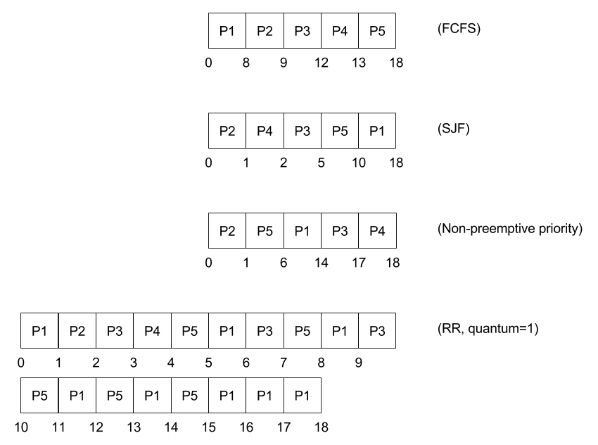

# Practicum Week 2 Exercises

### Chapter 5

__1.1 Explain why the term process scheduling is actually incorrect. (5.1)__

The term process scheduling is incorrect because it are (kernel-level or user-level) threads that are scheduled and not the processes themselves. This means that the program itself can partially be running, because it can have multiple threads. Which are executed independently.

The short-term scheduler selects a process from the processes in memory that are ready to execute and allocates the CPU to that process. So it is the process (in the form of a Process Control Block) that is allocated, but a thread that is actually scheduled.

__1.2 Explain the difference between a CPU scheduler and a dispatcher. (5.4)__

The dispatcher is the module that gives control of the CPU to the process selected by the short-term scheduler. A dispatcher is a part of the CPU scheduler which handles switching context, switching to user mode, and jumping to the proper location in the user program to restart that program. So it is the CPU scheduler that picks the process that is to be scheduled, but the dispatcher that stops the running process and starts the other process (the context switching).

The CPU scheduler can have different methods of picking the next process. Its main function is to handle picking the processes effectively and efficiently. So there is a lot of logic and there are smart techniques involved. Whereas the dispatcher should be robust and as fast as possible, since it is invoked during every process switch. The time it takes for the dispatcher to stop one process and start another running is known as the dispatch latency. This latency should be kept as low as possible.

__1.3 Suppose the following processes arrive for execution at the times indicated. Each process will run for the amount of time listed. In answering the questions, use non-preemptive scheduling, and base all decisions on the information you have at the time the decision must be made. (5.7)__

| Process | Arrival Time | Burst Time |
| :------ | :----------- | :--------- |
| P1      | 0.0          | 7          |
| P2      | 0.5          | 3          |
| P3      | 1.0          | 2          |

Milliseconds are used as unit of measurement.

a. __What is the average turnaround time (ATT) for these processes with the Fist Come First Server (FCFS) scheduling algorithm?__

> Process order: P1, P2, P3.
>
> ( (0 - 0 + 7) + (7 - 0.5 + 3) + (10 - 1 + 2) ) / 3 = ( 7 + 9.5 + 11) / 3 = 27.5 / 3 = 9.167
>
> The average turnaround time with FCFS scheduling is 9.167 milliseconds.

b. __What is the average turnaround time (ATT) for these processes with the Shortest Job First (SJB) scheduling algorithm?__

> Process order: P1, P3, P2.
>
> ( (0 - 0 + 7) + (7 - 1 + 2) + (9 - 0.5 + 3) ) / 3 = ( 7 + 8 + 11.5) / 3 = 26.5 / 3 = 8.833
>
> The average turnaround time with SJB scheduling is 8.833 milliseconds.

c. __What is the average turnaround time (ATT) for these processes with the Future Knowledge Scheduling (FKS) algorithm?__

> Process order: P3, P2, P1.
>
> ( (1 - 1 + 2) + (3 - 0.5 + 3) + (6 - 0 + 7) ) / 3 = ( 2 + 5.5 + 13) / 3 = 20.5 / 3 = 6.833
>
> The average turnaround time with FKS is 6.833 milliseconds.

__1.4 Explain the term CPU burst. (5.3)__

Process execution consists of a cycle of CPU execution and I/O wait. A CPU burst is when a process is executing a piece of code instead of waiting on an I/O task. A CPU burst is the amount of time a process uses the processer until it is enters a (I/O) waiting state or - requests to be or - is terminated.

Process execution begins with a CPU burst. That is followed by an I/O burst, which is followed by another CPU burst, then another I/O burst, and so on. Eventually, the final CPU burst ends with a system request to terminate execution. CPU bursts generally are characterized as a exponential or hyperexponential curve, with a large number of short CPU bursts and a small number of long CPU bursts. An I/O-bound program typically has many short CPU bursts. A CPU-bound program might have a few long CPU bursts. This distribution can be important in the selection of an appropriate CPU-scheduling algorithm.

__1.5 Consider the following set of processes, with the length of the CPU burst given in milliseconds (5.8):__

| Process | Arrival Time | Burst Time | Priority |
| :------ | :----------- | :--------- | :------- |
| P1      | 0            | 8          | 3        |
| P2      | 0            | 1          | 1        |
| P3      | 0            | 3          | 3        |
| P4      | 0            | 1          | 4        |
| P5      | 0            | 5          | 2        |

a. __Draw four Gantt charts that illustrate the execution of these processes using the following scheduling algorithms: FCFS, SJF, non-preemptive priority (a smaller priority number implies a higher priority) and RR (quantum = 1)__



b. __What is the turnaround time of each process for each of the scheduling algorithms in part a?__

| Process | FCFS | SJF | Non-preemptive priority | RR |
| :------ | :--- | :-- | :---------------------- | :- |
| P1      | 8    | 18  | 14                      | 18 |
| P2      | 9    | 1   | 1                       | 2  |
| P3      | 12   | 5   | 17                      | 10 |
| P4      | 13   | 2   | 18                      | 4  |
| P5      | 18   | 10  | 6                       | 15 |

c. __What is the waiting time of each process for each of these scheduling algorithms?__

| Process     | FCFS    | SJF     | Non-preemptive priority | RR      |
| :---------- | :------ | :------ | :---------------------- | :------ |
| P1          | 0       | 10      | 6                       | 10      |
| P2          | 8       | 0       | 0                       | 1       |
| P3          | 9       | 2       | 14                      | 7       |
| P4          | 12      | 1       | 17                      | 3       |
| P5          | 13      | 5       | 1                       | 10      |
| &nbsp;      |         |         |                         |         |
| Total       | 42      | 18      | 38                      | 31      |
| __Average__ | __8.4__ | __3.6__ | __7.6__                 | __6.2__ |


d. __Which of the algorithms results in the minimum average waiting time (over all the processes)?__

> Shortest Job First with an average of 3.6 milliseconds.

__1.7 Which of the following scheduling algorithms could result in starvation? (5.9)__

Both Shortest Job First and Priority scheduling can result in starvation. If short jobs or jobs with low priority (respectively) are continuedly fed to the scheduler, the longer jobs or jobs with a higher priority may not be scheduled. This is called indefinite blocking, or starvation.

Aging is a technique to prevent starvation, where information of the waiting time is held by the scheduler, to give processes that are waiting longer a higher priority in the waiting queue. So the chance they get scheduled gets higher the longer they are waiting, which makes sure the process will always be scheduled eventually.

### Chapter 6

__2.1 Consider the two general approaches to handle critical sections in operating systems. Discuss the favor for the preemptive approach and the difficulties with SMP architectures. (6.1)__


__2.2 Explain the differences between a counting semaphore and a binary semaphore. (6.2)__

__2.3 Describe how a program can overcome the need for busy waiting. (6.3)__

### Programming Exercise

__3.1 Using semaphores, modify this program so that it limits the number of concurrent connections. (6.4)__

```java
import java.net.*;
import java.io.*;
import java.util.concurrent.*;

class Worker implements Runnable {

	private int sleepTime = 10;

	private Socket sock;
	private Semaphore sem;

	public Worker( Socket sock, Semaphore sem ) {
		this.sock = sock;
		this.sem  = sem;
	}

	public void run() {
		try {
			PrintWriter pout = new PrintWriter( sock.getOutputStream(), true );

			while( sleepTime > 0 ) {
				String s = ( sleepTime == 1 ? " second." : " seconds." );

				pout.println( "Sleeping " + sleepTime + " more " + s );

				Thread.sleep( 1000 );

				sleepTime -= 1;
			}
		}
		catch( InterruptedException ie ) { }
		catch( IOException ioe ) { }
		finally {
			try {
				sock.close();
			}
			catch( IOException ioe2 ) {}

			sem.release();
		}
	}
}


public class TimedServer {

	public static final int PORT  = 2500;
	public static final int LIMIT = 2;

	public static void main( String[] args ) {
		Socket sock;

		try {
			ServerSocket server = new ServerSocket( PORT );
			Semaphore sem       = new Semaphore( LIMIT );

			while( true ) {
				sem.acquire();

				sock = server.accept();

				Thread worker = new Thread( new Worker( sock, sem ) );
				worker.start();
			}
		}
		catch( InterruptedException ie ) { }
		catch( java.io.IOException ioe ) { }
	}
}
```

__3.2 The given program segment produces a race condition. Do the following:__

a.

b.

c.