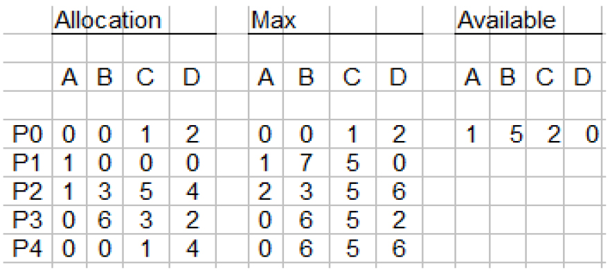

# Practicum Week 3 Exercises

### Chapter 7

##### 1.1 There are three major methods for handling deadlock (see Chapter 7.3.1). But actually there are four. Describe these four methods for handling deadlock.

1. __Deadlock Prevention.__ For a deadlock to be possible, each necessary condition (mutual exclusion, hold and wait, no preemption, and circular wait) must hold. When at least one of these conditions cannot hold, the occurance of a deadlock can be prevented. These methods specify (and constrain) the way resources are accessed.

2. __Deadlock Avoidance.__ Deadlocks can be avoided by limiting how requests can be made via the deadlock avoidance methods. By defining a safe state, the system must have additional information about the resources in advance. In this way the system can decide for each request if it can be satisfied or that the process should wait. In other words if it can allocate resources safely to each process (up to its maximum amount).

3. __Deadlock Detection.__ In environments where the system does not have a deadlock-prevention or deadlock-avoidance algorithm in place, a deadlock situation may occur. Here the system can provide an algorithm that examines the state of the system to determine whether a deadlock has occured. Additionally it can provide an algorithm to recover from the deadlock.

4. __Ignoring Deadlocks.__ The likelyness for deadlocks to occur is generally very small. Ignoring deadlocks may not cause any problems, but in the case it does the system (which will not detect the deadlock) will not be able to finish the process. Which will result in lower CPU performance, because the process is spending CPU cycles but not doing anything. On a personal computer, for example, this might not matter. Since the computer is rebooted almost every day. The hanging process(es) will be utilizing a part of the CPU (depending on the scheduling algorithm) but will also be terminated when shutting down the computer.

##### 1.2 Consider the following snapshot of a system.

__Totals__

|            | A   | B   | C   | D   |
| :--------- | :-- | :-- | :-- | :-- |
| Allocation | 2   | 9   | 10  | 12  |
| Max        | 3   | 22  | 21  | 16  |
| Available  | 1   | 5   | 2   | 0   |

Answer the following questions using the banker's algorithm:

__a. What is the content of the matrix Need?__

|            | A   | B   | C   | D   |
| :--------- | :-- | :-- | :-- | :-- |
| P0         | 0   | 0   | 0   | 0   |
| P1         | 0   | 7   | 5   | 0   |
| P2         | 1   | 0   | 0   | 2   |
| P3         | 0   | 0   | 2   | 0   |
| P4         | 0   | 6   | 4   | 2   |
| __Total__  | 1   | 13  | 11  | 4   |

__b. Is the system in a safe state?__

Yes it is. With an availability tuple of `(1, 5, 2, 0)`, either process P0 or P3 could run. When P3 is done and has released its resources, the availability tuple is `(1, 5, 0, 0) + (0, 6, 5, 2) = (1, 11, 5, 2)`. Which satisfies the need of any other process.

Processing could occur in order P0, P3, P1, P2, P4.

__c. If a request from process Pi arrives for (0, 4, 2, 0), can the request be granted immediately?__

Yes it can. The resulting availability tuple will be `(1, 0, 0, 0)`, which allows process P0 to run. After P0 releases its resources, the availability will be `(1, 0, 1, 2)`. Which allows P2 to run, and so on.

Processing could occur in order P0, P2, P3, P2, P4.

##### 1.3 Java's locking mechanism (the synchronized statement) is considered reentrant. That is, if a thread acquires the lock for an object (by invoking a synchronized method or block), it can enter other synchronized methods or blocks for the same object. Explain how deadlock would be possible if Java's locking mechanism were not reentrant.

This would allow threads to easily deadlock itself by acquiring a lock on an object and then calling a method which also requires a lock on that object. The second acquire would then block until the first acquire is released, which will never happen because the thread forever waits on the second acquire.

### Programming Exercise

##### 2.1 Write a multithreaded program that implements the banker's algorithm discussed in Section 7.5.3.

