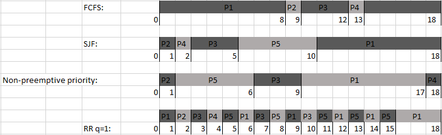

# Practicum 2.1 - Week 2

## Chapter 1

### 1.1: Explain why the term process scheduling is actually incorrect. (5.1)  
The term process scheduling is often used incorrectly because it is usually not the 'processes', but the kernel-level 'threads' that get scheduled by the operating system.

### 1.2: Explain the difference between a CPU scheduler and a dispatcher. (5.4)   	
A CPU scheduler selects a process to gain control of the CPU next, but does not perform any context switching and does not actually start the program.  
The rest of those operations is up to the dispatcher. The dispatcher switches context, switches to User Mode, and jumps to the right location in the program in order to 'resume' it.

### 1.3: Suppose the following processes arrive for execution at the times indicated. Each process will
run for the amount of time listed. In answering the questions, use non-preemptive scheduling, and
base all decisions on the information you have at the time the decision must be made. (5.7)  

|Process|Arrival Time|Burst Time|
|-------|------------|----------|
|P1		|0.0 		 |7 		|
|P2		|0.5 		 |3 		|
|P3 	|1.0 		 |2 		|

#### a) The Average Turnaround Time with FIFO:
P1: 7  
P2: 7 - 0.5 + 3 = 9.5
P3: 9.5 - 1.0 + 2 = 10.5  

> 7 + 9.5 + 10.5 / 3 = 9

#### b) The Average Turnaround Time with SJF (Shortest Job First):
P1: 7  
P3: 7 - 1.0 + 2 = 8  
P2: 8 - 0.5 + 3 = 10.5  

> 7 + 8 + 10.5 / 3 = 8.5

#### c) The Average Turnaround Time with SJB and Idle:

Idle: 1  
P3: 2 - 0 = 2  
P2: 2 + 0.5 + 3 = 5.5  
P1: 5 + 7 = 12

> 2 + 5.5 + 12 / 3 = 6.5

### 1.4: Explain the term CPU burst. (5.3)
A CPU burst is a short period of time where the CPU is utilized by one process. For example: in the assignments above, every process (P1, P2, P3) gets a 'process burst' for as long as the 'burst time'.

### 1.5: Consider the following set of processes, with the length of the CPU burst given in milliseconds (5.8)
|Process|Burst Time|Priority|
|-------|----------|--------|
|P1		|8		   |3		|
|P2		|1 		   |1  		|
|P3 	|3		   |3		|
|P4		|1 		   |4		|
|P5		|5		   |2		|  

The process assumed to have arrived in the order P1, P2, P3, P4, P5, all at time 0.  
#### a) Draw four Gantt charts that illustrate the execution of these processes using the following scheduling algorithms: FCFS, SJF, non-preemptive priority (a smaller priority number implies a higher priority) and RR (quantum = 1)
;

#### b) What is the turnaround time of each process for each of the scheduling algorithms in part a?
##### FCFS:
|Process|Turnaround Time|
|-------|---------------|
|P1		|8				|
|P2		|9				|
|P3		|12				|
|P4		|13				|
|P5		|18				| 

##### SJF:
|Process|Turnaround Time|
|-------|---------------|
|P1		|18				|
|P2		|1				|
|P3		|5				|
|P4		|2				|
|P5		|10				|

##### Non-preemptive priority:
|Process|Turnaround Time|
|-------|---------------|
|P1		|17				|
|P2		|1				|
|P3		|9				|
|P4		|18				|
|P5		|6				|

##### Round Robin with Q=1
|Process|Turnaround Time|
|-------|---------------|
|P1		|18				|
|P2		|2				|
|P3		|10				|
|P4		|4				|
|P5		|15				|

#### c) What is the waiting time of each process for each of these scheduling algorithms?
##### FCFS:
|Process|Waiting Time|
|-------|---------------|
|P1		|0				|
|P2		|8				|
|P3		|9				|
|P4		|12				|
|P5		|13				| 

##### SJF:
|Process|Waiting Time|
|-------|---------------|
|P1		|10				|
|P2		|0				|
|P3		|2				|
|P4		|1				|
|P5		|5				|

##### Non-preemptive priority:
|Process|Waiting Time|
|-------|---------------|
|P1		|9				|
|P2		|0				|
|P3		|6				|
|P4		|17				|
|P5		|1				|

##### Round Robin with Q=1
|Process|Waiting Time|
|-------|---------------|
|P1		|10				|
|P2		|1				|
|P3		|7				|
|P4		|3				|
|P5		|10				|
#### d) Which of the algorithms results in the minimum average waiting time (over all the processes)?
Average waiting time:  

FCFS:  
0 + 8 + 9 + 12 + 13 / 5 = 8.4  

SJF:	  
10 + 0 + 2 + 1 + 5 / 5 = 3.6  

Non-preemptive priority:  
9 + 0 + 6 + 16 + 1 / 5 = 6.4  

RR Q = 1:  
10 + 1 + 7 + 3 + 10 / 5 = 6.2  

So **SJF** has the lowest average waiting time.

### 1.7: Which of the following scheduling algorithms could result in starvation? (5.9)

- a. First-come, first-served
- b. Shortest job first
- c. Round robin
- d. Priority  

Both **Shortest Job First** and **Priority** can result in starvation.  
For example if a process with a burst time of 8 ms has to wait for a (theoretically) endless stream of processes with a shorter burst time, this first process will never be executed.  
Also for Priority the same problem occurs: if a process with a low priority has to wait for a (theoretically) endless stream of processes with a higher priority, this first process will never be executed.

### 2.1: Consider the two general approaches to handle critical sections in operating systems. Discuss the favor for the preemptive approach and the difficulties with SMP architectures. (6.1)
Both the preemptive and non-preemptive approaches have a multitude of pros and cons:

|Approach|Pros|Cons|
|--------|----|----|
|Preemptive|-More suitable for real-time programming <br> -More responsive|-Race conditions could occur|
|Non-preemptive|-Not vulnerable to race conditions <br> -Less difficult to design for SMP architectures|-Can often be less responsive|

### 2.2: Explain the differences between a counting semaphore and a binary semaphore. (6.2)
A **counting semaphore** can have any value, for example you can define a resource as only having 5 available at once.  
Contrary, a **binary semaphore** supports less values, a binary semaphore can only be 1 or 0 (accessible or inaccessible/available or unavailable)

### 2.3: Describe how a program can overcome the need for busy waiting. (6.3)
By using Semaphores. A semaphore simply 'blocks' the process or thread from continuing if the semaphore has no permits available. So until the .release() method is called, the process or thread will be blocked.  This means that there is no need to continuously check one variable, as the semaphore itself will wake the process when it has a permit available.

## Programming Exercises
###	3.1 Servers can be designed to limit the number of open connections. For example, a server may wish to have only N socket connections open at any point in time. After N connections have been made, the server will not accept another incoming connection until an existing connection is released. In the source code available on Wiley PLUS, there is a program named TimedServer.java that listens to port 2500. When a connection is made (via telnet or the supplied client program TimedClient.java), the server creates a new thread that maintains the connection for 10 seconds (writing the number of seconds remaining while the connection remains open). At the end of 10 seconds, the thread closes the connection. Currently, TimedServer.java will accept an unlimited number of connections. Using semaphores, modify this program so that it limits the number of concurrent connections. (6.4)

### TimedServer.java
```java
import java.net.*;
import java.io.*;
import java.util.concurrent.*;

class Worker implements Runnable
{
	private int sleepTime = 10;

	private Socket connection;

    private Semaphore semaphore;

	public Worker(Socket connection, Semaphore semaphore) {
		this.connection = connection;
        this.semaphore = semaphore;
	}

	public void run() {
		try {
			PrintWriter pout = new PrintWriter(connection.getOutputStream(), true);

			while (sleepTime > 0) {	
				String s = (sleepTime == 1) ? " second." : " seconds.";
				pout.println("Sleeping " + sleepTime + " more " + s);
				Thread.sleep(1000);
				sleepTime -= 1;
			}

			// now close the socket connection and release a semaphore permit
			connection.close();
            semaphore.release();

		}
		catch (InterruptedException ie) { }
		catch (IOException ioe) { }
	}
}

public class TimedServer
{
	public static final int PORT = 2500;

    private static Semaphore semaphore = new Semaphore(3, true);

	public static void main(String[] args) {
		Socket connection;
		
		try {
			ServerSocket server = new ServerSocket(PORT);

			while (true) {

                // Try to acquire a semaphore permit.
                try {
                    semaphore.acquire();
                } catch (Exception e){
                    System.out.println(e.getMessage());
                }

				connection = server.accept();

				Thread worker = new Thread(new Worker(connection, semaphore));
				worker.start();
			}
		}
		catch (java.io.IOException ioe) { }
	}
}
```

### 3.2
#### a. Identify the data involved in the race condition.
#### b. Identify the location (or locations) in the code where the race condition occurs.
#### c. Using Java synchronization, fix the race condition. Also modify decreaseCount() so that a thread blocks if there aren’t sufficient resources available.