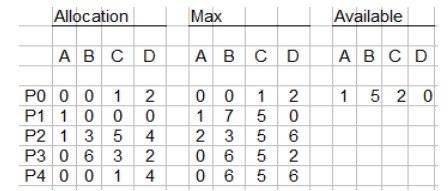

# Practicum Week 3 - Yuri Hoogeweg

## Chapter 7 - Deadlocks

### 1.1: There are three major methods for handling deadlock. (See Chapter 7.3.1). But actually there are four. Describe these four methods for handling deadlock.

1. Use a protocol to prevent deadlock, **Deadlock Prevention**. This ensures that the system will never even enter a deadlocked state in the first place. (by for example using mutual exclusion)
2. Allow the system to enter a deadlocked state, but develop a mechanism to detect this and recover from it. This is called **Deadlock Detection**
3. **Ignore deadlocks** and pretend they will never occur in the system. 
4. Avoiding a deadlock altogether by making the system calculate if any request will leave the system in a 'safe state'. **Deadlock Avoidance**

### 1.2: Consider the following snapshot of a system.


### Answer the following questions using the banker's algorithm:

**a. What is the content of the matrix Need?**

Need[i,j] = Max[i,j] - Allocation[i,j]. 
So starting with resource A:  
P0 = 0 - 0 = 0  
P1 = 1 - 1 = 0  
P2 = 2 - 1 = 1  
P3 = 0 - 0 = 0  
P4 = 0 = 0 = 0  

Using this method of calculation we get the following table as a result:  

**Need**

| P      | A   | B   | C   | D   |
| ------ | --- | --- | --- | --- |
| P0     | 0   | 0   | 0   | 0   |
| P1     | 0   | 7   | 5   | 0   |
| P2     | 1   | 0   | 0   | 2   |
| P3     | 0   | 0   | 2   | 0   |
| P4     | 0   | 6   | 4   | 2   |
| Total  | 1   | 13  | 11  | 4   |


**b. Is the system in a safe state?**  
A system is in a safe state if the amount of resources *needed* does not exceed the amount of resources *available*.

|                      | A   | B   | C   | D   |
| ---                  | --- | --- | --- | --- |
| **Available**        | 1   | 5   | 2   | 0   |

Yes, the system is ** in a safe state**. The amount of resources needed for either Process 3 or Process 0 to run does not exceed the amount of resources available. 

**c. If a request from process Pi arrives for (0, 4, 2, 0), can the request be granted immediately?**  
Yes, Pi would be safe to grant resources immediately because 0, 4, 2, 0 does not exceed the available 1, 5, 2, 0 because:

|                      | A   | B   | C   | D   |
| ---                  | --- | --- | --- | --- |
| **Need Pi**          | 0   | 4   | 2   | 0   |
| **Available**        | 1   | 5   | 2   | 0   |
| **Available - Need** | 1   | 1   | 0   | 0   |

The amount of 'needed' resources for Pi does not exceed the amount of available resources.

### 1.3: Java’s locking mechanism (the synchronized statement) is considered reentrant. That is, if a thread acquires the lock for an object (by invoking a synchronized method or block), it can enter other synchronized methods or blocks for the same object. Explain how deadlock would be possible if Java’s locking mechanism were not reentrant.  

When a lock is non-reentrant, a (synchronized/locked) method within an object cannot call another (synchronized/locked) method within that object because it waits for the lock, which it holds itself. This causes a deadlock because the object has to wait for the lock on itself, which it holds itself. Example: 

```java
class Class1{
	public synchronized void methodOne(){
		this.methodTwo();
	}

	public synchronized void methodTwo(){
	}
}
```

### 2.1: Write a multithreaded program that implements the banker's algorithm discussed in Section 7.5.3. Create n threads that request and release resources from the bank. The banker will grant the request only if it leaves the system in a safe state. You may write this program using Bibliographical Notes 271 either Pthreads or Win32 threads. It is important that access to shared data is safe from concurrent access. Such data can be safely accessed using mutex locks, which are available in both the Pthreads and Win32 API. Coverage of mutex locks in both of these libraries is described in "'producer-consumer problem" project in Chapter 6.

####BankImpl.java:
```java
package src;

import java.util.Timer;
import java.util.TimerTask;

/**
 * Created by Yuri on 19/5/2014.
 */
public class BankImpl implements Bank {
    private Customer[] customers = new Customer[Customer.COUNT];
    private int[] resources;

    private int[][] allocated;
    private int[][] maxDemand;

    public BankImpl(int[] resources){
        this.resources = resources;
        this.maxDemand = new int[Customer.COUNT][resources.length];
        this.allocated = new int[Customer.COUNT][resources.length];
    }

    /**
     * Add a customer to the bank.
     * @param threadNum The number of the customer being added.
     * @param maxDemand The maximum demand for this customer.
     */
    public void addCustomer(int threadNum, int[] maxDemand){
        this.customers[threadNum] = new Customer(threadNum, maxDemand, this);
        this.maxDemand[threadNum] = maxDemand;
    }

    /**
     * Outputs the available, allocation, max, and need matrices.
     */
    public void getState(){
        StringBuilder sb = new StringBuilder();

        // Append available
        sb.append("\n\nAvailable:\n----------\n");
        for(int i = 0; i < resources.length; i++){
            sb.append("Resource " + i + ": " + resources[i] + "\n");
        }

        // Append allocated
        sb.append("\n\nAllocated:\n----------\n");
        for(int i = 0; i < allocated[0].length; i++){
            // Sum of all allocated resources
            int sum = 0;

            for(int j = 0; j < allocated.length; j++){
                sum += allocated[j][i];
            }

            sb.append("Resource " + i + ": " + sum + "\n");
        }

        // Append max
        sb.append("\n\nMax demand:\n----------");
        for(int i = 0; i < maxDemand.length; i++){
            sb.append("\nCustomer " + i + ": ");

            // Append individual resources to line.
            for(int j = 0; j < maxDemand[i].length; j++){
                sb.append(" Resource " + j + ": " + maxDemand[i][j]);
            }
        }

        // Append need
        sb.append("\n\nNeed:\n----------");
        for(int i = 0; i < maxDemand.length; i++){
            sb.append("\nCustomer " + i + ": ");

            for(int j = 0; j < maxDemand[i].length; j++){
                sb.append(" Resource " + j + ": " + (maxDemand[i][j] - allocated[i][j]));
            }
        }

        // Print everything in one go.
        System.out.println(sb);
    }

    /**
     * Make a request for resources.
     * @param threadNum The number of the customer being added.
     * @param request The request for this customer.
     * @return  true The request is granted.
     * @return  false The request is not granted.
     */
    public synchronized boolean requestResources(int threadNum, int[] request){
        // Check if we allow this request to be processed.
        for(int i = 0; i < request.length; i++){
            // Decline request if it does not leave the system in safe state.
            if(request[i] > resources[i]){
                return false;
            }

            // Decline request if request is more than the max demand for that customer
            if(request[i] > maxDemand[threadNum][i]){
                return false;
            }
        }

        // Check if it leaves the system in a safe state
        if(!isSafeState(threadNum, request)){
            return false;
        }

        // Process request and return true
        for(int i = 0; i < request.length; i++){
            resources[i] -= request[i];
            allocated[threadNum][i] += request[i];
        }

        return true;
    }

    /**
     * Release resources.
     * @param threadNum The number of the customer being added.
     * @param release The resources to be released.
     */
    public synchronized void releaseResources(int threadNum, int[] release){
        // Release resources
        for(int i = 0; i < release.length; i++){
            resources[i] += release[i];
            allocated[threadNum][i] -= release[i];
        }
        getState();
    }

    private boolean isSafeState( int customerNum, int[] request ) {
        // Determines if a state is safe by trying to find a hypothetical set of requests by the processes that would allow each to acquire its
        // maximum resources and then terminate (returning its resources to the system).
        // Any state where no such set exists is an unsafe state.
        int[] clonedResources = resources.clone();
        int[][] clonedAllocated = allocated.clone();

        // First check if any part of the request requires more resources than are available (unsafe state)
        for(int i = 0; i < clonedResources.length; i++){
            if(request[i] > clonedResources[i]){
                return false;
            }
        }

        // If we reach this point, the first request was valid so we execute it on the simulated resources
        for(int i = 0; i < clonedResources.length; i++){
            clonedResources[i] -= request[i];
            clonedAllocated[customerNum][i] += request[i];
        }

        // Create new boolean array and set all to false
        boolean[] canFinish = new boolean[customers.length];

        for(int i = 0; i < canFinish.length; i++){
            canFinish[i] = false;
        }

        // Now check if there is an order wherein other customers can still finish after us
        for(int i = 0; i < customers.length; i++){
            // Find a customer that can finish a request. Loop through all resources per customer
            for(int j = 0; j < customers.length; j++){
                if(!canFinish[j]){
                    boolean temp = true;
                    for(int k = 0; k < clonedResources.length; k++){
                        // If the need (maxdemand - allocated = need) is noot bigger than the amount of available resources, thread can finish
                        if(!((maxDemand[j][k] - clonedAllocated[j][k]) > clonedResources[k])){
                            canFinish[j] = true;
                            for(int l = 0; l < clonedResources.length; l++){
                                clonedResources[l] += clonedAllocated[j][l];
                            }
                        }
                    }
                }
            }
        }

        // restore the value of need and allocation for this thread
        for (int i = 0; i < resources.length; i++) {
            clonedAllocated[customerNum][i] -= request[i];
        }

        // After all the previous calculations. Loop through the array and see if every customer could complete the transaction for their maximum demand
        for(int i = 0; i < canFinish.length; i++){
            if(canFinish[i] == false){
                return false;
            }
        }

        return true;
    }
}
```


