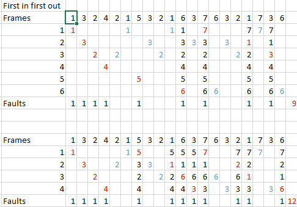
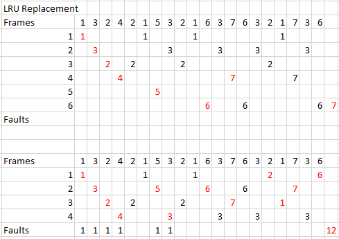
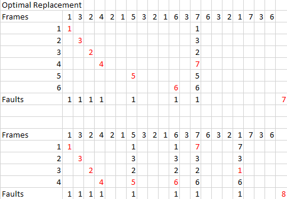

# Practicum opgaven week 4 - Yuri Hoogeweg

#### Why are page sizes always powers of 2? ####
Because the address is broken up into page bits and offset bits, because each bit position represents a power of 2, this will always result in a page size that originated from the powers of 2.

#### On a system with paging, a process cannot access memory that it does not own; why? How could the operating system allow access to other memory? Why should it or should it not ####

A process cannot access memory that it does not own because every process gets assigned its own space in memory. The process only uses logical addresses and has no concept of what physical address it writes to. The operating system uses a paging table to calculate the physical address and page number from the logical address. A process can't refer to a page it does not own simply because that page will not be in the page table, so the operating system will not be able to calculate the page table.  
An operating system COULD allow that by allowing pages that do not belong to the process into the process' page table. This would make it so that two different processes can read and write to the same memory address. However, an operating system should usually NOT do this, as it is only useful when used with two specific processes that NEED this for interprocess communication.

#### Consider a paging system with the page table stored in memory.####
a) If a memory reference takes 160 nanoseconds, how long does a paged memory reference take?  
b) If we add associative registers, and 75 percent of all page-table references are found in the associative registers, what is the effective memory reference time? (Assume that finding a page-table entry in the associative registers takes zero time if the entry is there.)  
  

_a)_ 160 nanoseconds to find the page number in the TLB + 160 nanoseconds to access the actual address in memory = 320 nanoseconds.  
_b)_ 0.75 x 160 + 0.25 * 320 = 200 nanoseconds

#### Given five memory partitions of 100 KB, 500 KB, 200 KB, 300 KB,and 600 KB (in order ), how would each of the first-fit, best-fit, and worst-fit algorithms place processes of 312 KB, 217 KB, 112 KB, and 426 KB (in order)? Which algorithm makes the most efficient use of memory?####

| Process | Requested Memory |
| ----    | ---              |
| P1      | 312 kb           |
| P2      | 217 kb           |
| P3      | 112 kb           |
| P4      | 426 kb           |

Memory:  

| 100 | 500 | 200 | 300 | 600 |
| --- | --- | --- | --- | --- |

First-fit: 
312 kb (P1) into 500 kb leaves 188 kb  
217 kb (P2) into 300 kb leaves 83 kb  
112 kb (P3) into 188 kb leaves 76 kb  
426 kb (P4) into 600 kb leaves 174 kb   
  
Best-fit:  
312 kb (P1) into 500 kb leaves 188 kb  
217 kb (P2) into 300 kb leaves 83 kb  
112 kb (P3) into 188 kb leaves 76 kb  
426 kb (P4) into 600 kb leaves 174 kb  
  
Worst-fit:  
112 kb (P3) into 600 kb leaves 488 kb
217 kb (P2) into 500 kb leaves 283 kb
312 kb (P1) is not possible
426 kb (P4) is not possible 
  
First-fit and Best-fit both make the most efficient use of memory, as they both have the same result in the end. Worst-fit has the least efficient use of memory, it leaves the most empty room within each hole and is not even able to fulfill P4 and P1's request.

####Assuming a 1-KB page size, what are the page numbers and offsets for the following address references (provided as decimal numbers)?####
a) 2275  
b) 18764  
c) 29000  
d) 254  
e) 16384  
  
__a)__  
2275 = 10|0011100011  
page number = 10<2> = 2 dec, offset = 0011100011<2> = 227 dec  
  
__b)__  
18764 = 10010|0101001100  
page number = 10010<2> = 18 dec, offset = 0101001100<2> = 332 dec  
  
__c)__  
29000 = 11100|0101001000  
page number = 11100<2> = 28 dec, offset = 0101001000<2> = 328 dec  
  
__d)__  
254 = 00|0011111110  
page number = 00<2> = 0 dec, offset = 0011111110<2> = 254  
  
__e)__
16384 = 10000|0000000000  
page number = 10000<2> = 16 dec, offset = 0  

####Consider the following page reference string:####
1, 3, 2, 4, 2, 1, 5, 3, 2, 1, 6, 3, 7, 6, 3, 2, 1, 7, 3, 6

How many page faults would occur for the following replacement algorithms, assuming four, and
six frames?
  
- FIFO 6 frames: 9
- FIFO 4 frames: 12
- LRU 6 frames: 7
- LRU 4 frames: 12
- Optimal 6 frames: 7
- Optimal 4 frames: 8

#####FIFO:

#####LRU:

#####Optimal:

####What is the copy-on-write feature and under what circumstances is it beneficial to use this feature? What is the hardware support required to implement this feature ?####

The copy-on-write feature copies a page when it's shared by multiple processes, and one of these processes tries to write to it. This is beneficial when a child process is supposed to have full access to the parent processes' memory space. The hardware support required is a way to check if a page is write-protected, and if it is, make a trap occur to call the copy-on-write feature.

####Explain the term hit ratio.####
The hit ratio is the percentage of time in which a page number is found in the TLB (Translation Look-aside Buffer). For example if the hit ratio is 50%, this means that only half of the time a page number is requested, it can be found in the TLB. Which means that there's a higher lookup time for all the times it's not found in the TLB. So a higher hit ratio is faster when it comes to requesting page numbers.

####Explain the term TLB reach. And explain three ways of how to increase the TLB reach.####
TLB Reach is the amount of memory reachable through the page numbers in the TLB. So if there's 5 page numbers saved in the TLB, and page size 1mb (1024 kb). The TLB reach is 1 mb x 5 = 5 mb. The formula to calculate the TLB reach is:  
__TLB reach = TLB entries x page size.__
  
Three ways of increasing the TLB reach are:  
- Increasing the amount of entries in the TLB. _This increases the first factor of the formula and will thus result in a higher reach_
- Increase the page size. _This increases the second factor of the formula and will thus result in a higher reach_
- Allowing multiple page sizes. _This allows every process to have a different page size and could result in a higher reach if some processes have bigger page sizes than normal. This DOES require the TLB to managed by software instead of hardware._