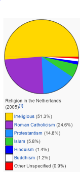
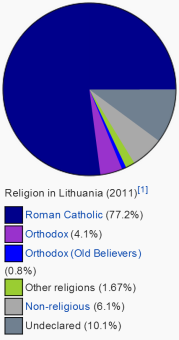

# Cultural Research

### The Netherlands

The Netherlands is a small country in Western Europe. The Netherlands is one of the world's most populous country, counting 17 million citizens on a surface area of over 41,000 km². A quarter of the Netherlands lies below sea level.

Outsiders often refer to the Netherlands to as "Holland", however, Holland is the identity of two western coastal provinces, North and South Holland. This area of the Netherlands contains the most businesses and have played a dominant role in the history of the Netherlands.

The politics of the country take place mostly in The Hague, this city is also host to the international criminal court. The Netherlands is described as a consociational state. Dutch politics and governance in general are characterised by striving for broad consensus on important issues. Both in politics and in society as a whole.

Religion in the Netherlands was predominantly Christian. However, there has been a steep decline of religious adherence. The Netherlands is one of the most secular countries in Western Europe. Only 39% of the country's population is affiliated to a religion.

The Netherlands has a maritime climate, with both mild summers and winters. The average annual temperature is around 10 degrees celsius. The time zone in the Netherlands is CE(S)T Central European (Summer) Time (GMT+2 during Daylight Savings Time (DST), GMT+1 without DST).

---

### Lithuania

Lithuania is a relatively small country in northern Europe. The largest of the three Baltic States. It neighbours Latvia, Belarus, Poland and Kaliningrad (Russian exclave). Lithuania's land mass is larger than the Netherlands.

Lithuania has an interesting history. During the 14th century, Lithuania was the largest country in Europe, and later formed a union with Poland, this Unian was dismantled in 1795. Lithuania recovered its freedom after World War 1. But was annexed by the USSR in 1940. Fifty years later they were the first Baltic state to become independent from Russia. On the 11th of March 1990.

The Lithuanian population consists of over three million people, mostly comprised of Lithuanians, but also Poles, Russians, Belarusians and other ethnic groups. The main religions are Roman Catholicism and Russian Orthodox.

Politics of Lithuania are democratic, the Prime Minister of Lithuania is the head of government, and there is a multi-party system.

The elderly in Lithuania most likely speak only Lithuanian or only Russian. Their children, currently the middle age-generation, will most likely speak a few more languages, such as Ukrainian or Polish, but usually not English. It is just more recently that English has began infiltrating Lithuania, and it is the younger generations (20s and younger) that have taken an interest in becoming fluent.

During the 2011 census, it was determined that the predominant religion in Lithuania is Christianity. The far majority of the Christians in Lithuania are Roman Catholicist. About 77% of the population is Roman Catholic according to the census.

In 2013 Lithuania was the country with the second best average internet speed, which was 38,85 mbps. The Netherlands was on the fourth place with an average speed of 34,52 mbps.

The climate in Lithuania is maritime and wet, Lithuania has both moderate winters and summers. The time zone in Lithuania is EE(S)T, Eastern European (Summer) Time (GMT+3 during Daylight Savings Time (DST), GMT+2 without DST).

---

## Differences between Dutch and Lithuanian business etiquette

### Communication
| Dutch                                                                                              | Lithuania                                                                                                 |
| -------                                                                                            | -----------                                                                                               |
| Strictly Sir/Madam.                                                                                | Titles are regularly used. In the absence use Sir or Madam.                                               |
| Very direct, will give their (raw) opinion                                                         | Politeness and courtesy get in the way of discussion.                                                     |
| Don't have problems saying no or giving their opinion up front                                     | Saying no is troublesome during the first stages of acquaintanceship.                                     |
| When something is "not bad", "okay" or "nice", it should be perceived as praise for the recipient. | Do not show their enthusiasm clearly. Something like "Not Bad" might be the highest appreciation you get. |
| Have a well-developed sense of humour                                                              | Dress appropriately. Clean and tidy.                                                                      |
| May look to you to break the ice                                                                   | Appreciate sincere smiling and eye contact.                                                               |
| Whispering in the presence of other people is considered impolite.                                 | Lithuanian humor is much like British humor. Dry.                                                         |
| Relatively loud conversations in public are not uncommon. However, they may be frowned upon.       | Lithuanians like talking about basketball, it is the country's favourite sport.                           |

##### Tips for Dutch people
1.	Try to guide the conversation in the right direction, but of course prevent coming across as rude.
2.	Ask open questions during the first (or first few) meetings.
3.	Don't be taken aback if you don't see clear signs of appreciation. Ask for confirmation if you're unclear about their opinion.
4.  The decision-making process in Lithuania is relatively quick. You simply have to agree on a specific date with your partner, and a decision will be ready by that date.

##### Tips for Lithuanian people
1. Don't be afraid to say no, Dutch people will not be offended by it.
2. Try not to take it as an insult when someone Dutch seems very direct. This __can__ be a good quality so that everyone knows each other's opinion. Besides, most Dutch people will not be aware of this tendency.

### Breaking the ice
Any topic of discussion is good to start a conversation with. You can talk about family, work, hobbies and sports. Lithuanians are fond of basketball and their national team is among the best in the world.
Talking about money is not an issue.

Do not suggest that Lithuanians are basically Russian, Lithuanians are proud to be independent. Do not start about the Eurovision song contest. The first time Lithuania participated they finished last, without a single point. After that, Lithuania withdrew and didn’t return until 1999. It just went downhill from there. Stick to sport subjects, that is their strong suit.

People are referred to by their title and surname. Colleagues and supervisors are usually referred to by their first name with Ponas (Mr), Panele (Ms) or Ponia (Mrs) or by title: Doctor, Professor, Director, Principle etc. and sometimes including last names. It is important not to address someone by their first name until invited to do so.

It is advisable to use the information on their business card to determine how to address an associate. So, if he or she has a title written in front of their name, then you should address the person by their title and surname

During a first meeting, Lithuanians will try to be formal and polite, listening very diligently. They like to ask questions to be sure that they understand what you are saying. Usually, Lithuanians like to build a personal relationship with potential partners before moving the conversation to business. It is essential that you try to speed up this process, as it is critical to the success of the discussion and doing business in Lithuania.

| Dutch                                            | Lithuania                                                          |
| -------                                          | -----------                                                        |
| Like to get on a first name basis                | Like to use the name and title on their bussiness cards            |
| Are informal and direct                          | Are formal and polite                                              |
| Like some smalltalk before moving on to business | Like to build a personal relationship before moving on to business |

##### Tips for Dutch people
1. Try starting with a light discussion. You can talk about family, work, hobbies and sports.
2. Use the name and title on the business cards to address your conversation partner.
3. Be friendly and try to build a personal relationship as soon as possible.

##### Tips for Lithuanian people
1. Do not be afraid of breaking the ice, even if a spontaneous joke or informal conversation seems odd. This is common in Dutch culture.
2. If you do not like being called by your first name, do not call Dutch people by their first name either. Alternatively you could take the more direct approach by telling them you do not like being called by your first name. Because directness is also appreciated within Dutch culture.

### Meetings
Meetings are attended by employees of similar status. A list of attendees and their functions is expected in the invitation. Business in Lithuania is generally a hierarchical afair. The chair of the meeting is likely the most senior attendee. He will determine the pace and decide who can speak. During the opening of the meeting the chair will do the introductions in order of seniority. Junior members mostly only respond to direct questions from senior members.

An agenda is used and followed sequentially.

Meetings should be short and well prepared. All relevant information should be present and questions need direct answers. Because of the strong hierarchy within businesses most decision are made by the most senior member. Any negotations should also be done with the most senior member because of this. You should never interrupt a speaker and wait patiently to talk.

The chair concludes the meeting with a summary of the discussion.

##### Presentations
Presentations should be short and concise and include data to support your position. Be prepared to answer any question anybody may have directly after the presentation.

### Negotiation Process
Decisions tend to be made from the top down. Avoid hard selling tactics and any sort of conflict or confrontational approach. It is always helpful to know a few words in the native language as a sign of respect and this will undoubtedly generate a friendlier response. Lithuanians prefer face-to-face meetings and do not give their trust easily. So if you want to do business in Lithuania, you have to build some trust first.

Lithuanians expect that any unsolicited approach is an attempt to sell them something and they expect the worst scenario. Business managers who do business with Russia, Ukraine, and Eastern Europe make personal relationships first, business comes later.

### Psychological factors that determine behaviour

It is important to avoid interrupting someone while they are speaking. Also, Lithuanians don't like long meetings, and will get annoyed if a meeting takes to long. This might affect the way they do business.

Lithuanians are typically modest in the work place. They usually speak in a calm and non emotive way without the use of unnecessary hand gestures and it is important therefore, that you remain collected during your meetings as any outbursts could lead to the dissolution of the relationship. They are also extremely polite during any interactions and it is considered rude to interrupt someone who is already speaking.

---

##### Minutes

The minutes of the meeting should summarize the main points of discussion, the decisions that were taken and the methods by which the desired results may be achieved. The minutes are sent by the party that is hosting the meeting and should be sent within a couple of days after the meeting. Irrespective of the outcome of the meeting, it is custom to write to your hosts and express thanks for their time and effort. Sending a follow-up email shows that you care and are prepared to make the effort required to form a good business relationship.

### General Etiquette
| Dutch                                                                                                  | Lithuania                                                                                               |
| -------                                                                                                | -----------                                                                                             |
| Business can be discussed during lunch. Business breakfasts are not common.                            |                                                                                                         |
| Spouses or partners are often included in a business dinner.                                           | Prefer to demonstrate individuality and compete rather than collaberate.                                |
| An individual's cooperation and trust are valued over performance; one-upmanship is frowned upon.      | Like to know who is in control. Find equal partnerships more difficult to manage.                       |
| In the Netherlands, commitments are taken seriously. Do not promise anything that cannot be delivered. | Believe in education but also believe that one can only do things for which one has had proper training |
| No set ritual for exchanging business cards, either after or during conversation | Tradition of exchanging business cards during the very first meeting |

##### Tips for Dutch people
1. The Roman Catholic Church has great influence on the daily life of Lithuanians, so swearing is not done.
2. There is no real difference between the style of a Dutch or Lithuanian business card.

##### Tips for Lithuanian people
1. Try not to make any promises that can not be delivered upon, be honest if you think you might not be able to fulfill a request.
2. There is no ritual for exchanging business cards in the Netherlands, so just exchanging business cards during the first meeting is fine.

### Non-verbal Communication
| Dutch                                                                                                                                                               | Lithuania                                                                                                                               |
| -------                                                                                                                                                             | -----------                                                                                                                             |
| When entering a room it is customary to shake hands with everyone present, then to shake hands again on leaving                                                     | Lithuanians like keeping a distance when speaking to someone. Especially when dealing with strangers. (About two arm lengths is common) |
| If seated, it is polite to stand up before shaking hands                                                                                                            | It is important to make eye contact, as refusing to make eyecontact is sometimes seen as a sign of dishonesty                           |
| The Dutch expect eye contact while speaking with someone. Looking away or staring at the ground is considered impolite and may be perceived as disinterest or lying | Lithuanians shake hands a lot. Hugging and kissing is only acceptable among close friends                                               |
| The Dutch tend to be reserved in using hand gestures. However, having your hands in pockets or arms crossed might be interpreted as a sign of disinterest           | Lithuanians do not use a lot of gestures or facial expressions.                                                                         |
| When yawning, coughing or sneezing, the mouth should be covered with a flat hand or fist                                                                            |                                                                                                                                         |

---

##### Tips for Dutch people:
1. Lithuanians have a strong sense of personal space, try to observe their degree of comfort and adjust distance accordingly.
2. Try to have an appropriate amount of eye contact but do not stare.

##### Tips for Lithuanian people:
1. Stand up before shaking hands
2. Make eye contact when talking to someone.
3. Cover your mouth with a flat hand or fist when coughing, sneezing or yawning.

### Punctuality
| Dutch                                                                                                    | Lithuania                                                          |
| -------                                                                                                  | -----------                                                        |
| Punctuality regarded as virtue                                                                           | Usually on time, expects partner to be on time                     |
| Accept apologies for late arrival                                                                        | Expect partner to notify them when partner is unexpectedly delayed |
| Calling half an hour or less before the start of a meeting to change the time is considered bad manners. | Use time as a tactic, especially if they know you have a deadline  |

##### Tips for Dutch people
1. Arrive for a meeting 10 minutes beforehand to decrease the chances of arriving late.
2. Give the Lithuanians a call when you might arrive late.
3. Lithuanians will not be rushed into making a deal until they believe it is in their best interest
4. Meetings often conclude with a summary of the discussion and a toast to future business

##### Tips for Lithuanian people
1. Dutch people may not pay as much respect to punctuality as you do, try emphasise on this during contact beforehand (without sounding accusing).
2. If you are late, it is no problem to just apologise after entering.

### Business hierarchy
77% of the Lithuanian population is roman catholic. Because of the strong hierarchy inside the roman catholic church in Lithuania and the big impact the church has on everyday life, these hierarchical trends carry on into the business aspects of the Lithuanian culture.

There is a strong sense of hierarchy within every part of the culture, this means that showing respect and deference to people of a higher authority is important. At the same time, bragging or overstating your higher authority when you are in this position is frowned upon, as most Lithuanians are very modest. It is also important to note that it is not uncommon for Lithuanian companies to have a strict hierarchy wherein senior-level businessmen only speak with people of the same rank. This could seem arrogant or even rude to some cultures.

In comparison, the Dutch usually have a significantly less strict hierarchy. Hierarchies in the Netherlands tend to have productivity as a goal, and function less as a way of respect or authority above another person.

##### Tips for Dutch people
1. Key tip here is to keep in mind that __not all__ Lithuanian companies will adhere to such a strict hierarchy, but to know that __if__ they do. Try to figure out your place in the meeting and do not be offended if a highly-ranked person in the company speaks to you less often (or not at all).

##### Tips for Lithuanian people
1. If Dutch people might seem offended when someone higher-up in the hierarchy does not talk to them as much, try explaining that this is not personal and mostly habitual and ritualistic.

---

### Dress code
| Dutch                                                  | Lithuania                                                                          |
| -------                                                | -----------                                                                        |
| Conservatively though less formal in different sectors | Conservatively, dark suit and tie for men, trouser suit/jacket and skirt for women |
| Better to be well-dressed rather than under-dressed    | Expect business associate to be well dressed                                       |

##### Tips for Dutch people
1. Dress well, dark suit and a tie is the safest option.

##### Tips for Lithuanian people
1. It is okay to dress less formally in some sectors or happenings, especially in IT it is not common for people to dress for example in jeans and a shirt.

### Gift giving
| Dutch                                                                  | Lithuania                                                                   |
| -------                                                                | -----------                                                                 |
| Don't like to feel obligated into gift giving                          | Do not expect gifts at first meeting                                        |
| Don't like receiving gifts with company logo or business card attached | Gifts are generally acceptable, especially souvenirs from your home country |
| If invited to a Dutch home, it's accepted to bring a gift              |                                                                             |
| Gifts are generally not given or expected at business meetings         |                                                                             |

##### Tips for Dutch people
1. For a meeting **after** the first meeting, bring a souvenir from your home country.
2. Depending on the time of the meeting, it might be a good idea to serve Stroopwafels. (These will also serve the purpose of being a 'souvenir', even though it's not really a gift)

##### Tips for Lithuanian people
1. Do not expect a gift during the first meeting.

### Bribery and Corruption
| Dutch                                                                 | Lithuania                                                            |
| -------                                                               | -----------                                                          |
| Reputation for honesty                                                | Average corruption and bribery. Anti-corruption measures on the rise |
| One of the highest transparency ratings in the world (9th out of 176) | Somewhat average transparency rating (48th out of 176)               |

---

### Basic words and phrases
| Dutch                     | Lithuania                |
| -------                   | -----------              |
| Hallo                     | Labas                    |
| Goedemiddag               | Laba diena               |
| Hoe gaat het?             | Kaip Sekasi              |
| Goed                      | Puikiai                  |
| Tot ziens                 | Viso gero                |
| Ik spreek geen Litouws    | As nekalbu lietuviskai   |
| Spreekt u Engels?         | Ar jus kalbate angliskai |
| Wat is u naam?            | Koks tavo vardas         |
| Mijn naam is ...          | Mano vardas ...          |
| Kunt u dat herhalen       | Prasom pakartoti         |
| Wilt u een moment wachten | Prasom palaukti          |
| Nee                       | Ne                       |
| Ja                        | Taip                     |
| Litouwen                  | Lietuva                  |
| Graag gedaan, alstublieft | Prasom                   |
| Dank u                    | Aciu                     |
| Pardon                    | Atsiprasau               |
| Ik weet het niet          | Nezinau                  |

Additionally the YouTube video (https://www.youtube.com/watch?v=QuKwMV8-cjE) can be used for practising pronounciation.

## Weather Terminology:
| Dutch                 | Lithuanian         | English             | Explanation                                                                                       |
| ---                   | ---                | ---                 | ---                                                                                               |
| Temperatuur           | temperatūra        | Temperature         | The temperature, in both countries measured in Celsius                                            |
| Dauwpunt              | Rasos taškas       | Dew point           | Temperature at which water in the air condenses into liquid water                                 |
| Luchtdruk             | Oro slėgis         | Air pressure        | The amount of pressure exerted on a surface by the total weight of all the air above that surface |
| Zichtbaarheidsafstand | žvilgsnio atstumas | Sight distance      | The distance a person can see before the vision is obscured                                       |
| Windsnelheid          | vėjo greitis       | Wind velocity/speed | The speed of wind moving from one place to another (km/h)                                         |
| Neerslag              | krituliai          | Precipitation       | Any product of condensation of water in the atmosphere (hail, rain, etc.)                         |
| Bewolking             | apsiniaukęs        | Overcast            | The amount of clouds in the atmosphere                                                            |
| Windrichting          | vėjas              | Wind direction      | The direction the wind is traveling to                                                            |
| Onweer                | audra              | (Thunder)storm      | Form of turbulent weather characterized by the presence of lightning                              |
| Tornado               | tornadas           | Tornado             | Violently rotating column of air that is in contact with the surface of the earth                 |
| Weer                  | oras               | Weather             | State of the atmosphere                                                                           |
| Klimaat               | klimatas           | Climate             | Measure of the average pattern of variation in weather measurements in a given region             |

---

## What to do in Groningen
Although Groningen is not a very large city, it does have an important role as the main urban centre of this part of the country, particularly in the fields of music and other arts, education, and business. The large number of students living in Groningen also contributes to a diverse cultural scene for a city of its size. This chapter will cover things you can do in the city of Groningen.

### Museums
The most important and most famous museum in Groningen is the Groninger Museum. With the construction of its current building, designed by Alessandro Mendini, the museum has been transformed into one of the most modern and innovative of its kind in the Netherlands. In addition, the city also has a maritime museum, a university museum, a comics museum and a graphical museum.

### Sightseeing
Last but not least Groningen is a great place for sightseeing. The city is more than 500 years old which means that there are many old buildings to be watched. Probably the biggest sightseeing attraction is the church located on the Grote Markt called the Martinikerk, which has a large tower called the Martinitoren. The Martinitoren can be scaled by stair to get a nice view of Groningen.

Other sightseeing attractions in the center of Groningen are city hall, The Korenbeurs (a building where crops and goods were traded many years ago but now functions as a supermarket), another church called the AA Kerk and the main building of the University of Groningen.

### Nightlife
Groningen has a wide variety of bars and clubs to entertain the large population of students that live in the city. Almost every street in Groningen has at least one bar on it, which amounts to more than a hundred bars spread across Groningen.

## Sources
1. [http://businessculture.org/eastern-europe/lithuania/business-etiquette/](http://businessculture.org/eastern-europe/lithuania/business-etiquette/)
2. [http://businessculture.org/eastern-europe/lithuania/business-communication/](http://businessculture.org/eastern-europe/lithuania/business-communication/)
3. [http://www.ediplomat.com/np/cultural_etiquette/ce_nl.htm](http://www.ediplomat.com/np/cultural_etiquette/ce_nl.htm)
4. [http://businessculture.org/western-europe/business-culture-in-netherlands/business-etiquette-in-netherlands/](http://businessculture.org/western-europe/business-culture-in-netherlands/business-etiquette-in-netherlands/)
5. [http://en.wikipedia.org/wiki/Dutch_customs_and_etiquette](http://en.wikipedia.org/wiki/Dutch_customs_and_etiquette)
6. [http://www.nationsencyclopedia.com/Europe/Netherlands-CLIMATE.html](http://www.nationsencyclopedia.com/Europe/Netherlands-CLIMATE.html)
7. [http://www.readysetpresent.com/products/powerpointcountries/lithuania.htm](http://www.readysetpresent.com/products/powerpointcountries/lithuania.htm)
8. [http://www.kwintessential.co.uk/etiquette/doing-business-lithuania.html](http://www.kwintessential.co.uk/etiquette/doing-business-lithuania.html)
9. [http://www.intercultures.ca/cil-cai/ci-ic-eng.asp?iso=lt](http://www.intercultures.ca/cil-cai/ci-ic-eng.asp?iso=lt)
10. [http://www.lietuva.lt/en/business/business_etiquette](http://www.lietuva.lt/en/business/business_etiquette)
11. [http://www.goabroad.com/articles/10-things-you-should-know-before-teaching-in-lithuania](http://www.goabroad.com/articles/10-things-you-should-know-before-teaching-in-lithuania)
12. [http://businessculture.org/eastern-europe/lithuania/meeting-etiquette/](http://businessculture.org/eastern-europe/lithuania/meeting-etiquette/)
