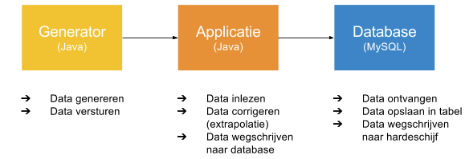
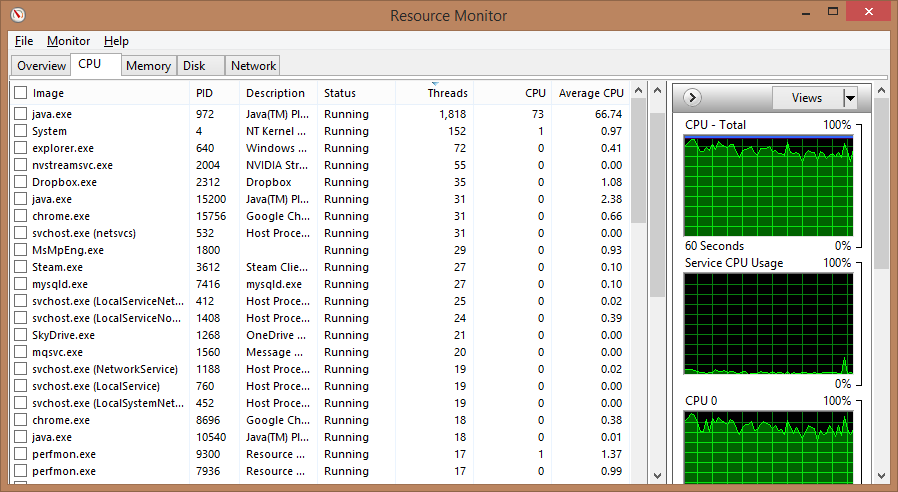
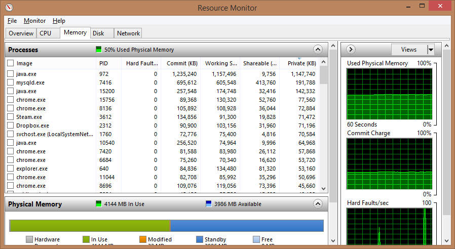
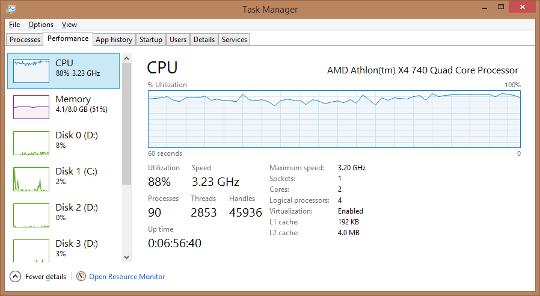

# Leertaak 1 <small>Testrapport</small>

> __Groep:__ 1a
> __Auteurs:__ André Nanninga &amp; Maurits van Mastrigt
> __Datum:__ 17 mei 2014

---

# Inhoud

- Inleiding
- Verklaring programmaonderdelen
	- Infrastructuur
	- Applicatie
- Stresstest resultaten
- Machine gebruik tijdens stresstesting
- Bottlenecks
	+ Trage invoerverwerking
	+ Trage datacorrectie
	+ Efficiënt verwerken van weerdata
	+ MySQL database
	+ Batchen van queries
- Conclusie

---

# Inleiding

Dit rapport beschrijft de conclusies en bevindingen van André Nanninga en Maurits van Mastrigt tijdens het uitwerken van Leertaak 1. Zoals in de opdrachtomschrijving aangegeven, bevat dit rapport de volgende onderdelen:

- Een verklaring van de programmaonderdelen die de gevraagde functies vormgeven;
- De resultaten van de stresstest inclusief verklaring voor de maximale snelheid van de gegevenswerking, waarbij het volgende zal worden aangegeven:
	+ Een overzicht van de gebruikte systemen en infrastructuur;
	+ De gehaalde verwerkingssnelheid (aantal verwerkte berichten per seconde);
	+ Welke resource de bottleneck vormt en door welk proces dit wordt veroorzaakt;
- Een onderbouwing met behulp van de verzamelde gegevens.

De in dit rapport beschreven bevindingen zullen worden meegenomen in het uitwerken van leertaken twee en vijf.

---

# Verklaring programmaonderdelen

Onderstaand een toelichting op de verschillende programmaonderdelen. Met als eerst een beschrijving van de infrastructuur en daarop volgend meer over de gebouwde applicatie.

## Infrastructuur

	

In het bovenstaande figuur is te zien waar elk onderdeel verantwoordelijk voor is. Zowel de generator, applicatie, en de database werden gedraaid op één en dezelfde desktop PC. Deze PC heeft de volgende specificaties:

	Besturingssysteem: Windows 8.1 Pro 64-bit
	CPU: AMD Athlon(tm) X4 740 Quad Core Processor
	Geheugen: 8.00GB Dual-Channel DDR3 @ 665MHz (9-9-9-24)
	Moederboord: ASRock FM2A75 Pro4-M (CPUSocket)
	Opslag: RAID 0 (3x 232GB Seagate ST3250318AS ATA Device)

De __generator__ is door de Hanzehogeschool als uitvoerbaar `.jar`-bestand aangeleverd. Deze Java applicatie genereert (semi)willekeurge weerdata aan de hand van een aantal instellingen. Zo kon het aantal workers worden ingesteld, waarmee de server applicatie eenvoudig te stresstesten was.

De bovengenoemde __applicatie__ is volledig zelf ontwikkeld. Hier lagen wel een aantal vereisten aan ten grondslag. Samengevat moest er een multithreaded Java applicatie worden gebouwd, die door middel van sockets een XML stream uitleest. De ingelezen gegevens moeten vervolgens worden omgezet naar een werkbaar data formaat. Ontbrekende data moest worden gecorrigeerd en de data moest worden opgeslagen in een RDBMS. De specifieke uitwerking van de applicatie zal nader worden toegelicht in paragraaf _Applicatie_.

Voor opslag van de gegevens is er gekozen voor de bekende relationele database __MySQL__. Met name het makkelijke opzetten van deze database, en de uitgebreide online hulpmiddelen, heeft hier de doorslag in gegeven (ten opzichte van PostgreSQL).

---

## Applicatie

In deze paragraaf zullen de verschillende klassen van de applicatie in volgorde van verloop worden toegelicht.

### Runner

De zogeheten "Runner" van de applicatie dient als startpunt van de applicatie. Hierin wordt de applicatie geconfigureerd en worden de initiële onderdelen, zoals de Server, opgezet. Tevens dient de _Runner_ klasse voor het meten van de resultaten, waarbij de server een X aantal seconden wordt gedraaid - terwijl ondertussen metingen worden verricht als:

- Ingevoerde configuratiewaarden
- Uiteindelijke looptijd (inclusief afronden,)
- Geheugengebruik
- Aantal workers (inkomende connecties)
- Aantal database queries
- Verwachtte aantal records
- Uiteindelijke aantal records
- Efficiëntie

Met deze meeteenheden kan applicatiebrede efficiëntie worden gemeten, wat enorm heeft geholpen bij het verbeteren van de applicatie code.

### Server

De _Server_ klasse beheert de database connectie en accepteert continue inkomende connecties. Elke inkomende connectie wordt overgezet naar een aparte _Worker_, welke vervolgens de data inleest en verwerkt. Deze connecties komen voor nu nog vanaf de generator.

### Database

De _Database_ klasse zorgt voor zowel het tot stand brengen van een verbinding met de MySQL database, als eenvoudige communicatie met deze database. Tevens maakt deze laag van abstractie het wisselen van database mogelijk, wat voordelig is (met oog op de tweede leertaak).

Voor het optimaal uitvoeren van de "INSERT" queries, waarbij de ingelezen weerdata wordt ingeschoten in de database, is er gekozen om deze uit te laten voeren door een aparta klasse: _Database.Executor_. De database klasse maakt een _Executor_ instantie aan voor elke query die wordt gedraaid, waardoor er eenvoudig in één keer een grote hoeveelheid aan records ingeschoten kan worden.

### Database.Executor

Voor een zo hoog mogelijke verwerkingssneldheden is er gekozen voor het maken van een _Executor_, waarin een database query in een aparte thread wordt uitgevoerd. Dit voorkomt dat de applicatie blokkeert tijdens het inschieten van de ingelezen weerdata.

Tevens wordt er per query honderd tot tweehonderd records ingeschoten, waardoor veel overhead (verificatie van data, parsen van query, locken van tabel, etc.) tot het minimale wordt gereduceerd.

### Worker

De _Worker_ klasse staat centraal aan de applicatie. Deze moet zo snel mogelijk de ingelezen gegevens verwerken tot bruikbare weerdata, de data corrigeren (met behulp van een _Corrector_), en inschieten in de database (met behulp van een _RecordBuffer_). Dit laatste punt kost weinig tijd door het gebruik query buffering en de _Database.Executor_ klasse (welke in een aparte thread draait).

### Corrector

Elke _Worker_ heeft een eigen instantie van de _Corrector_, welke - zoals de naam aanduidt - de missende waarden corrigeert. Met behulp van extrapolatie wordt een schatting gedaan van de ontbrekende waarde. Tevens wordt er gekeken of de temperatuur niet meer dan 20% afwijkt van de vorige waarde. Is dit wel het geval, dan wordt ook deze gecorrigeerd (naar het maximale percentage).

Ook de _Corrector_ moet snel handelen, omdat deze draait in dezelfde thread als de bijbehorende _Worker_. Dit is mogelijk, omdat de corrector zeer efficiënt omgaat met de gegevens. Dit is behaald door  het vinden van de juiste record buffer grootte (het aantal records waar extrapolatie op wordt toegepast) en extreme code optimalatie.

### RecordBuffer

Zodra de weerdata - in de vorm van een record object - is ingelezen en (waar nodig) gecorrigeerd, wordt deze doorgegeven aan een _RecordBuffer_. Elke _Worker_ heeft naast een eigen _Corrector_ ook een eigen _RecordBuffer_, waarin honderd tot tweehonderd record objecten worden vastgehouden en in een batch worden ingeschoten. Dit inschieten wordt gedaan met behulp van een _Database.Executor_. Dit batchen van "INSERT" queries vergroot de verwerkingssnelheid van de applicatie in grootte mate.

### Record

De _Record_ klasse dient voornamelijk als hulpmiddel bij gebruik van een record object. De ingelezen weerdata wordt namelijk niet omgezet naar een klasseinstantie, maar wordt in een Object array gezet. Dit is zeer lichtgewicht, waardoor er enkel een hulpmiddel nodig is voor het defineren van de indexen van de array (welke sleutel welke waarde representeert).

Tevens biedt deze klasse de mogelijkheid de missende waarde van een record object te bepalen en een record object om te zetten naar een database "INSERT" query. Op deze manier wordt alle logica intern gehouden, waardoor de applicatie code netjes blijft en andere klassen geen kennis hoeven te hebben van het record object. Met uitzondering van het ophalen van een waarde (bijvoorbeeld `record[ Record.WNDDIR ]`) en het instellen van een waarde (bijvoorbeeld `record[ Record.WNDDIR ] = value;`).

---

# Stresstest resultaten

De stress is meerdere malen uitgevoerd met een doorloop tijd van 30 seconden. De resultaten hiervan zijn als volgt:

| Clusters      | Geheugen  | Queries | Aantal records | Verwacht aantal records | Efficiëntie |
| :------------ | :-------- | :------ | :------------- | :---------------------- | :---------- |
| 800           | 499.50 MB | 872     | 246480         | 240000                  | 102.70%     |
| 800           | 557.00 MB | 872     | 247910         | 240000                  | 103.30%     |
| 800           | 507.00 MB | 879     | 248000         | 240000                  | 103.33%     |
| 800           | 509.00 MB | 881     | 248000         | 240000                  | 103.33%     |
| 800           | 499.50 MB | 888     | 247480         | 240000                  | 103.12%     |
| __Gemiddeld__ |           |         |                |                         |             |
| 800           | 514.40 MB | 878.4   | 247574         | 240000                  | 103.16%     |

De verwerkingssnelheid van de applicatie is hoog genoeg om alle 800 clusters die de generator kan simuleren af te handelen. De reden dat de efficiëntie boven 100% is omdat de workers niet direct worden gestopt en zo dus nog een klein beetje data kunnen ontvangen.

Tijdens het uitvoeren van de stresstest verbruikt de applicatie ongeveer 50% cpu tijd, de MySQL database verbruikt slechts 5%. Qua geheugen gebruik zien we dat MySQL 1.5GB in beslag neemt en de applicatie 700MB. Verder schrijft de MySQL database ongeveer 4MB/s weg naar de harde schijven.

Uit een stresstest van een half uur kwamen de volgende getallen:

| Clusters | Geheugen  | Queries | Aantal records | Verwacht aantal records | Efficiëntie |
| :------- | :-------- | :------ | :------------- | :---------------------- | :---------- |
| 800      | 498.00 MB | 24019   | 12428690       | 14400000                | 86.31%      |
| 700      | 500.00 MB | 23756   | 12336400       | 12600000                | 97.91%      |
| 600      | 497.50 MB | 20688   | 10804980       | 10800000                | 100.05%     |

Uit deze data lijkt het dat het aantal queries op de database een bottleneck is. Het limiet wat de MySQL database aan over een half uur lijkt rond de 23.000 queries te liggen.

Een aanpassing aan grootte van de buffer in de _RecordBuffer_ zorgt ervoor dat er minder queries worden verstuurd maar deze queries wel meer data bevatten. De resultaten van een stresstest van een half uur met een grotere buffer zijn als volgt:

| Clusters | Geheugen  | Queries | Aantal records | Verwacht aantal records | Efficiëntie |
| :------- | :-------- | :------ | :------------- | :---------------------- | :---------- |
| 800      | 645.50 MB | 15597   | 14408000       | 14400000                | 100.06%     |

Het aantal queries is drastisch gedaalt en daarmee is de efficientie weer op 100% gekomen. Hier staat wel tegen over dat de applicatie meer geheugen in beslag neemt, 650MB tegenover 500MB, maar dat levert geen verdere problemen op.

Te concluderen valt dat de grootste bottleneck momenteel nog de MySQL database is. Hoewel uiteindelijk deze toch de ruwweg 8000 records per seconde aan kan blijkt dit toch het punt te zijn waar het het eerste fout gaat. De vraag is hoe goed de MySQL database mee schaalt wanneer meer clusters worden gebruikt en wanneer de applicatie langer draait.

## Machine gebruik tijdens stresstesting

Onderstaand schermafdrukken van respectievelijk het CPU-, geheugen-, en hardeschijfgebruik.

  

  

  

---

# Bottlenecks

Onderstaand worden de hindernissen beschreven die op het pad zijn gekomen tijdens het ontwikkel van de applicatie.

## Trage invoerverwerking

Door onvoldoende optimalisatie van de _Worker_ klasse, blokkeerde deze. Dit kwam doordat het corrigeren van ontbrekende data relatief lang duurde en het inschieten van de records in de database in dezelfde thread gebeurde, waardoor deze bleef wachten totdat de database query voltooid was. Hierdoor werd de invoer niet snel genoeg uitgelezen, wat het maximaal haalbare cluster verlaagde tot circa 120.

## Trage datacorrectie

Zoals in vorige paragraaf genoemd, werkte de _Corrector_ klasse in eerste instantie niet snel genoeg. Deze was niet geoptimaliseerd voor snelheid, waardoor er nog over een _ArrayList_ geïtereerd werd (in plaats van het vele malen snellere object array) en er onnodige `if/else` constructies aanwezig waren. Na een korte optimalisatieronde werden deze problemen verholpen, wat de applicatie circa 10% sneller maakte. Zo nam het corrigeren en inschieten van de weerdata eerst circa 90% van de applicatie CPU tijd in beslag, terwijl deze na het optimaliseren slechts rond de 80% kostte.

## Efficiënt verwerken van weerdata

Het verwerken van de XML data die wordt verzonden door de generator kan met behulp van een XML parser of door het gebruik van reguliere expressies. Deze twee methoden zijn traag vergeleken met het uitvoeren van een simpele substring. Elk datasegment is omringt door twee XML tags (bijvoorbeeld `<WNDDIR>` en `</WNDDIR>`), door de tekst na de eerste `>` en voor de laaste `<` eruit te knippen kan de, in dit geval, windrichting waarde worden uitgelezen.

## MySQL database

Een MySQL database is op zichzelf zeer efficiënt in het verwerken van grote hoeveelheden data, echter was een opdrachtvoorwaarde dat er referentiële integriteit werd afgedwongen. Wat inhoudt dat voor elk weerdata record dat wordt ingeschoten, er moet worden gecontroleerd of het bijbehorende station wel bestaat. Dit kost de nodige tijd, wat een bottleneck kan veroorzaken.

Echter na het aan/uit zetten van de referentiële integriteit kon er worden geconcludeerd dat dit een kleinere impact heeft dan verwacht. Zo konden er (op een andere testmachine) met referentiële integriteit circa 160 clusters worden verwerkt, terwijl er circa 175 konden worden verwerkt zodra dit werd uitgezet.

## Batchen van queries

Het bufferen van queries om records in te schieten, om deze vervolgens per honderd tot tweehonderd uit te voeren, scheelt bepaalde overhead. Bij het batchen en versturen van de queries zit een bepaalde willekeurigheid. Deze willekeurigheid moet er voor zorgen dat niet elke _RecordBuffer_ tegelijkertijd een batch verstuurde. Denk hierbij aan het verwerken van de query, locken van de tabel, etc. Door het batchen van deze queries kon de applicatie circa acht keer meer data verwerken. Dit verschil is significant, ondanks dat het batchen de complexiteit van de applicate verhoogd.

---

# Conclusie

De doel van de opdracht is het bepalen van bottlenecks in de applicatie, waardoor uiteindelijk het verwerken van 8000 records per seconde niet mogelijk zou moeten zijn. Er zijn veel punten die een bottleneck kunnen vormen, waaronder de hardware, het verwerken van data, het corrigeren van data, en het opslaan van de data in de database. Echter is er gebleken dat elk obstakel, door middel van de juiste optimalisaties, te overkomen is. Zo moest er voor elk onderdeel van de applicatie worden gekeken naar de mogelijke bottlenecks en waar hierin winst te behalen is. Met behulp van goede meetinstrumenten (zoals Java HProf en handmatig gemeten waarden) kon de kink in de kabel telkens relatief snel worden bepaald.

Het doel van 8000 records per seconde verwerken is uiteindelijk gehaald. Hieraan ligt ten grondslag dat elk onderdeel van de applicatie is gescheiden (waaronder met behulp van multithreading), waardoor er een zo hoog mogelijk haalbare verwerkingssnelheid kon worden bereikt. Tevens bleek het gebruik van de juiste hardware (een quadcore desktop PC) noodzakelijk, omdat met het gebruik van laptops het maximaal gehaalde aantal clusters slechts 560 was.

Desalniettemin is de database telkens de grootste bottleneck gebleken. Er moest hievoor grote hoeveelheden code worden geoptimaliseerd. Tevens kan er niet worden uitgesloten dat bij het langer draaien van de applicatie, de dataverwerkingssnelheid constant blijft. Het is goed mogelijk dat deze afneemt, doordat de database de invoer niet op tijd kan verwerken (door schrijfsnelheiden naar de hardeschijf en het intact houden van de referentiële integriteit).