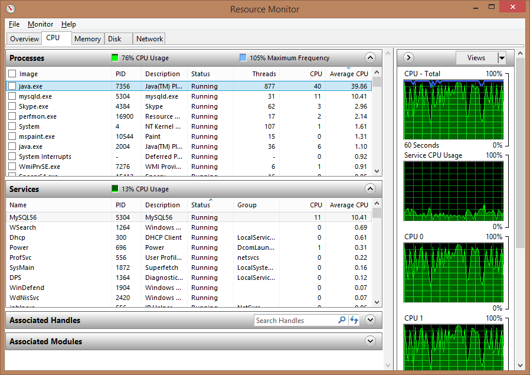
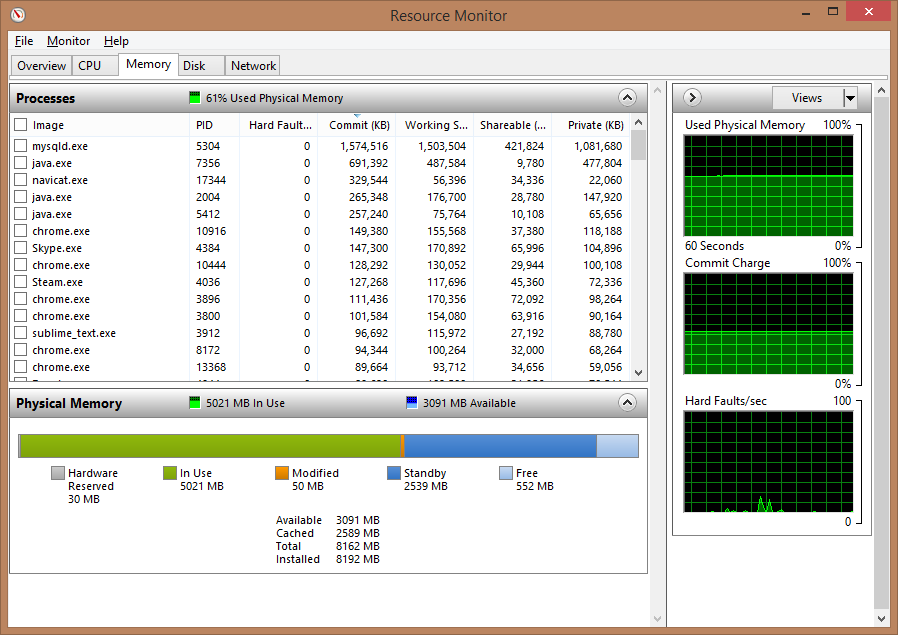
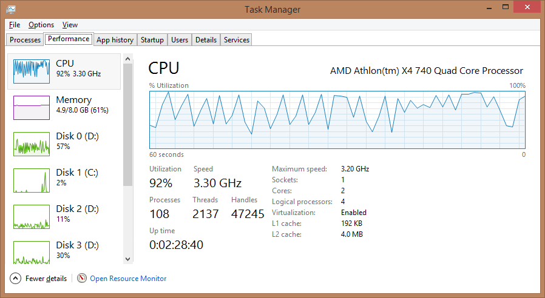

# Leertaak 1 <small>Stresstest rapportage</small>

> __Groep:__ 1a  
> __Auteurs:__ André Nanninga &amp; Maurits van Mastrigt  
> __Datum:__ 17 mei 2014  

---

# Inhoud

- Verklaring programmaonderdelen
	- Infrastructuur
	- Applicatie
- Stresstest resultaten
- Conclusie
- Verklarende woordenlijst

---

# Verklaring programmaonderdelen

## Infrastructuur

	

De generator, applicatie en database zijn getest op een _Windows 8.1 Pro 64-bit_ omgeving. De Hardwarespecificaties zijn als volgt:

* __CPU:__ AMD Athlon(tm) X4 740 Quad Core Processor
* __Geheugen:__ 8.00GB Dual-Channel DDR3 @ 665MHz
* __Moederboard:__ ASRock FM2A75 Pro4-M
* __Opslag:__ RAID 0
  * 232GB Seagate ST3250318AS
  * 232GB Seagate ST3250318AS
  * 232GB Seagate ST3250318AS

## Applicatie

| Klasse            | Omschrijving                                                                                                                                    | Heeft&nbsp;instantie(s)&nbsp;van  |
| :---------        | :-----------------------------                                                                                                                  | :---------              |
| Runner            | Start van de applicatie, welke de server een X aantal seconden laat draaien en ondertussen metingen verricht.                                   | Server                  |
| Server            | Maakt een connectie met de database en accepteert continue inkomende connecties (vanaf de generator) en zet hiervoor Worker instanties op.      | Database, Worker        |
| Database          | Verbinding met de database. Stelt het systeem in staat database queries uit te voeren.                                                          | Database.Executor       |
| Database.Executor | Klasse voor het uitvoeren van een query in een aparte thread.                                                                                   |                         |
| Worker            | Accepteert inkomende data, verwerkt en corrigeert de data (middels een Corrector), en schiet deze in de database in (middels een RecordBuffer). | Corrector, RecordBuffer |
| Corrector         | Corrigeert ontbrekende of afwijkende data door middel van extrapolatie.                                                                         |                         |
| RecordBuffer      | Houdt een X aantal records vast, om deze één database query te kunnen inschieten (batch).                                                       | Database                |
| Record            | Helper voor waarden in een record object. voor het bepalen van missende waarden en het omzetten naar een database "INSERT" query.               |                         |

---

# Stresstest resultaten

De stress is meerdere malen uitgevoerd met een doorloop tijd van 30 seconden. De resultaten hiervan zijn als volgt:

| Clusters      | Geheugen  | Queries | Aantal records | Verwacht aantal records | Efficiëntie |
| :------------ | :-------- | :------ | :------------- | :---------------------- | :---------- |
| 800           | 499.50 MB | 872     | 246480         | 240000                  | 102.70%     |
| 800           | 557.00 MB | 872     | 247910         | 240000                  | 103.30%     |
| 800           | 507.00 MB | 879     | 248000         | 240000                  | 103.33%     |
| 800           | 509.00 MB | 881     | 248000         | 240000                  | 103.33%     |
| 800           | 499.50 MB | 888     | 247480         | 240000                  | 103.12%     |
| __Gemiddeld__ |           |         |                |                         |             |
| 800           | 514.40 MB | 878.4   | 247574         | 240000                  | 103.16%     |

De verwerkingssnelheid van de applicatie is hoog genoeg om alle 800 clusters die de generator kan simuleren af te handelen. De reden dat de efficiëntie boven 100% is omdat de workers niet direct worden gestopt en zo dus nog een klein beetje data kunnen ontvangen. 

Tijdens het uitvoeren van de stresstest verbruikt de applicatie ongeveer 50% cpu tijd, de MySQL database verbruikt slechts 5%. Qua geheugen gebruik zien we dat MySQL 1.5GB in beslag neemt en de applicatie 700MB. Verder schrijft de MySQL database ongeveer 4MB/s weg naar de harde schijven. 

Uit een stresstest van een half uur kwamen de volgende getallen: 

| Clusters | Geheugen  | Queries | Aantal records | Verwacht aantal records | Efficiëntie |
| :------- | :-------- | :------ | :------------- | :---------------------- | :---------- |
| 800      | 498.00 MB | 24019   | 12428690       | 14400000                | 86.31%      |
| 700      | 500.00 MB | 23756   | 12336400       | 12600000                | 97.91%      |
| 600      | 497.50 MB | 20688   | 10804980       | 10800000                | 100.05%     |
  
Uit deze data lijkt het dat het aantal queries op de database een bottleneck is. Het limiet wat de MySQL database aan over een half uur lijkt rond de 23.000 queries te liggen. 

Een aanpassing aan grootte van de buffer in de RecordBuffer zorgt ervoor dat er minder queries worden verstuurd maar deze queries wel meer data bevatten. De resultaten van een stresstest van een half uur met een grotere buffer zijn als volgt:

| Clusters | Geheugen  | Queries | Aantal records | Verwacht aantal records | Efficiëntie |
| :------- | :-------- | :------ | :------------- | :---------------------- | :---------- |
| 800      | 645.50 MB | 15597   | 14408000       | 14400000                | 100.06%     |

Het aantal queries is drastisch gedaalt en daarmee is de efficientie weer op 100% gekomen. Hier staat wel tegen over dat de applicatie meer geheugen in beslag neemt, 650MB tegenover 500MB, maar dat levert geen verdere problemen op.

Te concluderen valt dat de grootste bottleneck momenteel nog de MySQL database is. Hoewel uiteindelijk deze toch de ruwweg 8000 records per seconde aan kan blijkt dit toch het punt te zijn waar het het eerste fout gaat. De vraag is hoe goed de MySQL database mee schaalt wanneer meer clusters worden gebruikt en wanneer de applicatie langer draait.

  
  
  

---

# Bottlenecks

- Worker blocking
- Slow Corrector 
- Efficient Parsen
- MySQL
- Query commiting

# Conclusie

+ [A] Een onderbouwing van je uitleg met behulp van gegevens van tools zoals taskmanager, perfmon, top (of door jouw gebruikte, vergelijkbare tools). Voeg screenshots van deze gegevens toe.

---

# Verklarende woordenlijst

- Thread
- Query
- Batch
- Generator