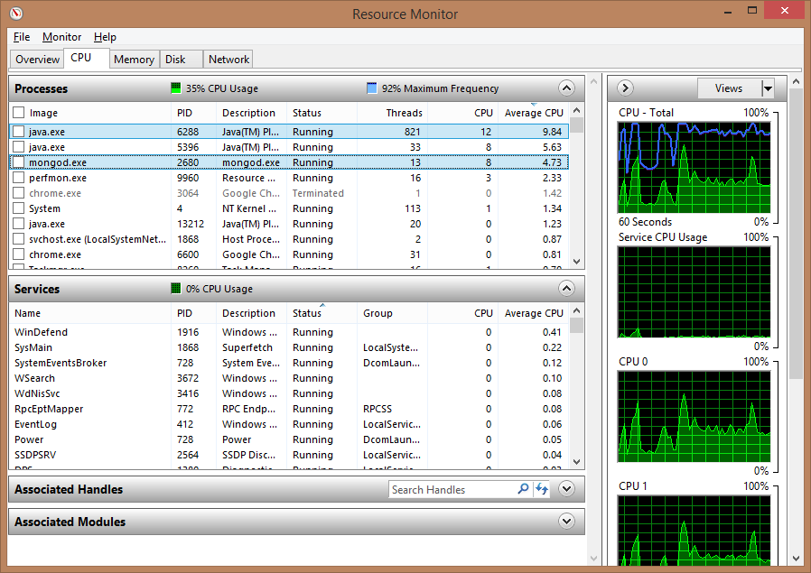
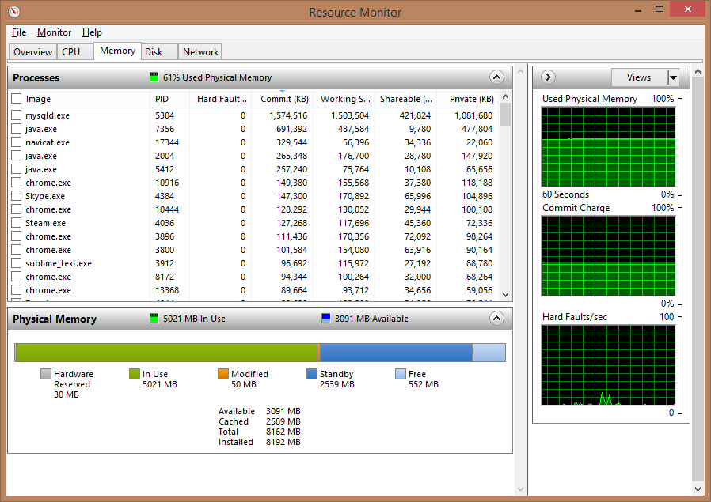

# Leertaak 2 <small>Testrapport</small>

> __Groep:__ 1a
> __Auteurs:__ André Nanninga &amp; Maurits van Mastrigt
> __Datum:__ 30 mei 2014

# Inhoud

- __Inleiding__								<span style="float:right;font-weight:bold">3</span>
- __Definitie leertaak twee__				<span style="float:right;font-weight:bold">X</span>
- __Probleemstelling__						<span style="float:right;font-weight:bold">X</span>
- __Verklaring programmaonderdelen__		<span style="float:right;font-weight:bold">X</span>
	- Infrastructuur						<span style="float:right;font-weight:normal">X</span>
	- Applicatie							<span style="float:right;font-weight:normal">X</span>
- __Stresstest resultaten__					<span style="float:right;font-weight:bold">X</span>
	- Machine gebruik tijdens stresstesting	<span style="float:right;font-weight:normal">X</span>
- __Conclusies & bevindingen__				<span style="float:right;font-weight:bold">X</span>

# Inleiding

Dit rapport beschrijft de conclusies en bevindingen van André Nanninga en Maurits van Mastrigt tijdens het uitwerken van Leertaak 2. Dit document zal eerst ingaan op de definitie van de tweede leertaak. Hierop volgend de een toelichting op de probleemstelling. Vervolgens zullen de programmaonderdelen en stresstest resultaten worden toegelicht, met afsluitend de conclusies & bevindingen.

# Definitie leertaak twee

In de tweede leertaak wordt voortborduurt op de eerste leertaak, waarbij er een oplossing moet worden gevonden voor het tegelijkertijd opslaan van gegevens uit meerdere bronnen, zonder dat deze elkaar beïnvloeden. Tevens mag de data niet worden opgeslagen in een relationele database en moet het mogelijk zijn tegelijkertijd weerdata uit te lezen.

Zoals in de leertaak beschreven, bevat dit rapport de volgende onderdelen:

- Een verklaring van de programmaonderdelen die de gevraagde functies vormgeven;
- De resultaten van de stresstest inclusief verklaring voor de maximale snelheid van de gegevenswerking, waarbij het volgende zal worden aangegeven:
	+ Een overzicht van de gebruikte systemen en infrastructuur;
	+ De gehaalde verwerkingssnelheid (aantal verwerkte berichten per seconde);
	+ Welke resource de bottleneck vormt en door welk proces dit wordt veroorzaakt;
- Een onderbouwing met behulp van de verzamelde gegevens;
- Een verklaring voor de gekozen opslagmethode;
- Een uitleg over de schaalbaarheid van het systeem.

De in dit rapport beschreven conclusies en bevindingen zullen worden meegenomen in het uitwerken van leertaak vijf.

# Probleemstelling

..

# Verklaring programmaonderdelen

Onderstaand een toelichting op de verschillende programmaonderdelen. Met als eerst een beschrijving van de infrastructuur en daarop volgend meer over de gebouwde applicatie.

## Infrastructuur

<center>
	
</center>

In het bovenstaande figuur is te zien waar elk onderdeel verantwoordelijk voor is. Zowel de generator, applicatie, en de database werden gedraaid op één en dezelfde desktop PC. Deze PC heeft de volgende specificaties:

> <span style="display:inline-block;width:140px">Besturingssysteem:</span> Windows 8.1 Pro 64-bit
> <span style="display:inline-block;width:140px">CPU:</span> AMD Athlon(tm) X4 740 Quad Core Processor
> <span style="display:inline-block;width:140px">Geheugen:</span> 8.00GB Dual-Channel DDR3 @ 665MHz (9-9-9-24)
> <span style="display:inline-block;width:140px">Moederboord:</span> ASRock FM2A75 Pro4-M (CPUSocket)
> <span style="display:inline-block;width:140px">Opslag:</span> RAID 0 (3x 232GB Seagate ST3250318AS ATA Device)

De __generator__ is door de Hanzehogeschool als uitvoerbaar `.jar`-bestand aangeleverd. Deze Java applicatie genereert (semi)willekeurge weerdata aan de hand van een aantal instellingen. Zo kon het aantal workers worden ingesteld, waarmee de server applicatie eenvoudig te stresstesten was.

De bovengenoemde __applicatie__ is volledig zelf ontwikkeld. Hier lagen wel een aantal vereisten aan ten grondslag. Samengevat moest er een multithreaded Java applicatie worden gebouwd, die door middel van sockets een XML stream uitleest. De ingelezen gegevens moeten vervolgens worden omgezet naar een werkbaar data formaat. Ontbrekende data moest worden gecorrigeerd en de data moest worden opgeslagen in non-relationale database. De specifieke uitwerking van de applicatie zal nader worden toegelicht in paragraaf _Applicatie_.

Voor opslag van de gegevens is er gekozen voor de meest bekende non-relationele database: __MongoDB__. Deze database is eenvoudig in opzet, kan zeer hoge lees- en schrijfsnelheden behalen, en schaalt enorm goed.

---

## Applicatie

In deze paragraaf zullen de verschillende klassen van de applicatie in volgorde van verloop worden toegelicht.

```
### Runner

De zogeheten "Runner" van de applicatie dient als startpunt van de applicatie. Hierin wordt de applicatie geconfigureerd en worden de initiële onderdelen, zoals de Server, opgezet. Tevens dient de _Runner_ klasse voor het meten van de resultaten, waarbij de server een X aantal seconden wordt gedraaid - terwijl ondertussen metingen worden verricht als:

- Ingevoerde configuratiewaarden
- Uiteindelijke looptijd (inclusief afronden,)
- Geheugengebruik
- Aantal workers (inkomende connecties)
- Aantal database queries
- Verwachtte aantal records
- Uiteindelijke aantal records
- Efficiëntie

Met deze meeteenheden kan applicatiebrede efficiëntie worden gemeten, wat enorm heeft geholpen bij het verbeteren van de applicatie code.

### Server

De _Server_ klasse beheert de database connectie en accepteert continue inkomende connecties. Elke inkomende connectie wordt overgezet naar een aparte _Worker_, welke vervolgens de data inleest en verwerkt. Deze connecties komen voor nu nog vanaf de generator.

### Database

De _Database_ klasse zorgt voor zowel het tot stand brengen van een verbinding met de MySQL database, als eenvoudige communicatie met deze database. Tevens maakt deze laag van abstractie het wisselen van database mogelijk, wat voordelig is (met oog op de tweede leertaak).

Voor het optimaal uitvoeren van de "INSERT" queries, waarbij de ingelezen weerdata wordt ingeschoten in de database, is er gekozen om deze uit te laten voeren door een aparta klasse: _Database.Executor_. De database klasse maakt een _Executor_ instantie aan voor elke query die wordt gedraaid, waardoor er eenvoudig in één keer een grote hoeveelheid aan records ingeschoten kan worden.

### Worker

De _Worker_ klasse staat centraal aan de applicatie. Deze moet zo snel mogelijk de ingelezen gegevens verwerken tot bruikbare weerdata, de data corrigeren (met behulp van een _Corrector_), en inschieten in de database (met behulp van een _RecordBuffer_). Dit laatste punt kost weinig tijd door het gebruik query buffering en de _Database.Executor_ klasse (welke in een aparte thread draait).

### Corrector

Elke _Worker_ heeft een eigen instantie van de _Corrector_, welke - zoals de naam aanduidt - de missende waarden corrigeert. Met behulp van extrapolatie wordt een schatting gedaan van de ontbrekende waarde. Tevens wordt er gekeken of de temperatuur niet meer dan 20% afwijkt van de vorige waarde. Is dit wel het geval, dan wordt ook deze gecorrigeerd (naar het maximale percentage).

Ook de _Corrector_ moet snel handelen, omdat deze draait in dezelfde thread als de bijbehorende _Worker_. Dit is mogelijk, omdat de corrector zeer efficiënt omgaat met de gegevens. Dit is behaald door  het vinden van de juiste record buffer grootte (het aantal records waar extrapolatie op wordt toegepast) en extreme code optimalatie.

### Record

De _Record_ klasse dient voornamelijk als hulpmiddel bij gebruik van een record object. De ingelezen weerdata wordt namelijk niet omgezet naar een klasseinstantie, maar wordt in een Object array gezet. Dit is zeer lichtgewicht, waardoor er enkel een hulpmiddel nodig is voor het defineren van de indexen van de array (welke sleutel welke waarde representeert).

Tevens biedt deze klasse de mogelijkheid de missende waarde van een record object te bepalen en een record object om te zetten naar een database "INSERT" query. Op deze manier wordt alle logica intern gehouden, waardoor de applicatie code netjes blijft en andere klassen geen kennis hoeven te hebben van het record object. Met uitzondering van het ophalen van een waarde (bijvoorbeeld `record[ Record.WNDDIR ]`) en het instellen van een waarde (bijvoorbeeld `record[ Record.WNDDIR ] = value;`).
```

# Stresstest resultaten

```
De stresstest is meerdere malen uitgevoerd met een doorloop tijd van 30 seconden. De resultaten hiervan zijn als volgt:

| Clusters      | Geheugen  | Queries | Aantal records | Verwacht aantal records | Efficiëntie |
| :------------ | :-------- | :------ | :------------- | :---------------------- | :---------- |
| 800           | 499.50 MB | 872     | 246480         | 240000                  | 102.70%     |
| 800           | 557.00 MB | 872     | 247910         | 240000                  | 103.30%     |
| 800           | 507.00 MB | 879     | 248000         | 240000                  | 103.33%     |
| 800           | 509.00 MB | 881     | 248000         | 240000                  | 103.33%     |
| 800           | 499.50 MB | 888     | 247480         | 240000                  | 103.12%     |
| __Gemiddeld__ |           |         |                |                         |             |
| 800           | 514.40 MB | 878.4   | 247574         | 240000                  | 103.16%     |

De verwerkingssnelheid van de applicatie is hoog genoeg om alle 800 clusters die de generator kan simuleren af te handelen. De reden dat de efficiëntie boven 100% is omdat de workers niet direct worden gestopt en zo dus nog een klein beetje data kunnen ontvangen.

Tijdens het uitvoeren van de stresstest verbruikt de applicatie ongeveer 50% cpu tijd, de MySQL database verbruikt slechts 5%. Qua geheugen gebruik zien we dat MySQL 1.5GB in beslag neemt en de applicatie 700MB. Verder schrijft de MySQL database ongeveer 4MB/s weg naar de hardeschijven.

Uit een stresstest van een half uur kwamen de volgende getallen:

| Clusters | Geheugen  | Queries | Aantal records | Verwacht aantal records | Efficiëntie |
| :------- | :-------- | :------ | :------------- | :---------------------- | :---------- |
| 800      | 498.00 MB | 24019   | 12428690       | 14400000                | 86.31%      |
| 700      | 500.00 MB | 23756   | 12336400       | 12600000                | 97.91%      |
| 600      | 497.50 MB | 20688   | 10804980       | 10800000                | 100.05%     |

Uit deze data lijkt het dat het aantal queries op de database een bottleneck is. Het limiet wat de MySQL database aan over een half uur lijkt rond de 23.000 queries te liggen.

Een aanpassing aan grootte van de buffer in de _RecordBuffer_ zorgt ervoor dat er minder queries worden verstuurd maar deze queries wel meer data bevatten. De resultaten van een stresstest van een half uur met een grotere buffer zijn als volgt:

| Clusters | Geheugen  | Queries | Aantal records | Verwacht aantal records | Efficiëntie |
| :------- | :-------- | :------ | :------------- | :---------------------- | :---------- |
| 800      | 645.50 MB | 15597   | 14408000       | 14400000                | 100.06%     |

Het aantal queries is drastisch gedaalt en daarmee is de efficientie weer op 100% gekomen. Hier staat wel tegen over dat de applicatie meer geheugen in beslag neemt, 650MB tegenover 500MB, maar dat levert geen verdere problemen op.

Te concluderen valt dat de grootste bottleneck momenteel nog de MySQL database is. Hoewel uiteindelijk deze toch de ruwweg 8000 records per seconde aan kan blijkt dit toch het punt te zijn waar het het eerste fout gaat. De vraag is hoe goed de MySQL database mee schaalt wanneer meer clusters worden gebruikt en wanneer de applicatie langer draait.
```

## Machine gebruik tijdens stresstesting

```
Onderstaand schermafdrukken van respectievelijk het CPU-, geheugen-, en hardeschijfgebruik.

<center>
  
</center>
<center>
  
</center>
<center>
  
</center>
```

# Conclusies & bevindingen

```
Toelichten:
- Weghalen buffer
- Winddown (afsluiten)
- Schaalbaarheid
```