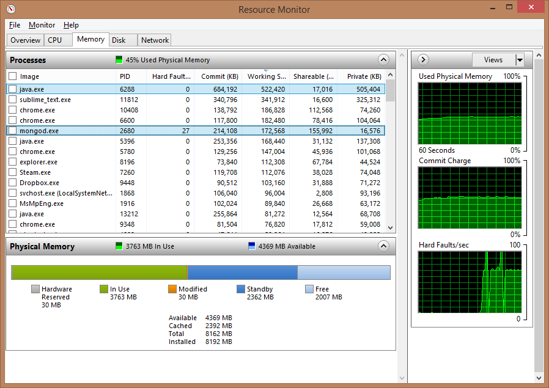

# Leertaak 2 <small>Testrapport</small>

> __Groep:__ 1a
> __Auteurs:__ André Nanninga &amp; Maurits van Mastrigt
> __Datum:__ 30 mei 2014

# Inhoud

- __Inleiding__								<span style="float:right;font-weight:bold">3</span>
- __Definitie leertaak twee__				<span style="float:right;font-weight:bold">X</span>
- __Probleemstelling__						<span style="float:right;font-weight:bold">X</span>
- __Verklaring programmaonderdelen__		<span style="float:right;font-weight:bold">X</span>
	- Infrastructuur						<span style="float:right;font-weight:normal">X</span>
	- Database								<span style="float:right;font-weight:normal">X</span>
	- Applicatie							<span style="float:right;font-weight:normal">X</span>
- __Stresstest resultaten__					<span style="float:right;font-weight:bold">X</span>
	- Machine gebruik tijdens stresstesting	<span style="float:right;font-weight:normal">X</span>
- __Conclusies & bevindingen__				<span style="float:right;font-weight:bold">X</span>
	- Eliminatie RecordBuffer				<span style="float:right;font-weight:normal">X</span>
	- Schaalbaarheid						<span style="float:right;font-weight:normal">X</span>

# Inleiding

Dit rapport beschrijft de conclusies en bevindingen van André Nanninga en Maurits van Mastrigt tijdens het uitwerken van Leertaak 2.

De rapportage is opgedeeld in drie delen: inleiding, resultaten, en conclusie. Waarbij in de inleiding de tweede leertaak, de probleemstelling en de programmaonderdelen zullen worden toegelicht. Hierop volgend worden de stresstest resultaten gespresenteerd en toegelicht. En afsluitend worden de conclusies en bevindingen beschreven.

Het uitgevoerde onderzoek is een vervolg op de uitwerking van de eerste leertaak.

# Definitie leertaak twee

In de tweede leertaak wordt voortborduurt op de eerste leertaak, waarbij er een oplossing moet worden gevonden voor het tegelijkertijd opslaan van gegevens uit meerdere bronnen, zonder dat deze elkaar beïnvloeden. Tevens mag de data niet worden opgeslagen in een relationele database en moet het mogelijk zijn tegelijkertijd weerdata uit te lezen.

Zoals in de leertaak beschreven, bevat dit rapport de volgende onderdelen:

- Een verklaring van de programmaonderdelen die de gevraagde functies vormgeven;
- De resultaten van de stresstest inclusief verklaring voor de maximale snelheid van de gegevenswerking, waarbij het volgende zal worden aangegeven:
	+ Een overzicht van de gebruikte systemen en infrastructuur;
	+ De gehaalde verwerkingssnelheid (aantal verwerkte berichten per seconde);
	+ Welke resource de bottleneck vormt en door welk proces dit wordt veroorzaakt;
- Een onderbouwing met behulp van de verzamelde gegevens;
- Een verklaring voor de gekozen opslagmethode;
- Een uitleg over de schaalbaarheid van het systeem.

De in dit rapport beschreven conclusies en bevindingen zullen worden meegenomen in het uitwerken van leertaak vijf.

# Probleemstelling

Het UNWDMI heeft toegang tot ruim 8000 weerstations verspreid over de hele wereld. Elk van deze weerstations sturen 24 uur per dag en 7 dagen per week elke seconde een aantal gegevens zoals:

* Identificatiecode van het station
* lokale datum en tijd
* weergegevens: 
  * temperatuur 
  * dauwpunt 
  * luchtdruk 
  * zichtbaarheid 
  * neerslag 
  * sneeuwdiepte 
  * bewolking 
  * windrichting 
  * windsnelheid 
  * gebeurtenissen

Bij het meten en verzenden van de meetwaarden gaat er nog wel eens wat mis. Zeker in afgelegen gebieden op de wereld kunnen er storingen in de weerstations optreden, die niet zo snel verholpen kunnen worden. Als gevolg daarvan kunnen meetwaarden soms irreëel zijn of zelfs ontbreken. Daarom vindt in de applicatie controleslag plaats voordat de meetgegevens opgeslagen worden in de centrale database. De applicatie gaat daarbij als volgt te werk.

* Indien één of meer meetwaarden ontbreken, worden ze door het systeem berekend door middel van extrapolatie van de dertig voorafgaande metingen. Dit komt ongeveer in 1% van alle gevallen voor.
* Een meetwaarde voor de temperatuur wordt als irreëel beschouwd indien ze 20% of meer groter is of kleiner is dan wat men kan verwachten op basis van extrapolatie van de dertig voorafgaande temperatuurmetingen. In dat geval wordt de geëxtrapoleerde waarde ± 20% voor de temperatuur opgeslagen. Voor de andere meetwaarden wordt deze handelswijze niet toegepast.

De hier beschreven handelswijze is volkomen geaccepteerd in de wereld van de meteorologie. Alle instellingen die weergegevens opslaan passen dit systeem toe en alle gebruikers van weerinformatie weten dat dit systeem toegepast wordt en nemen daar genoegen mee. Dat geldt niet alleen voor landelijke weerdiensten, maar ook voor commerciële weeradviesbureaus en onderzoeksinstituten.

De applicatie moet de weergegevens van 8000 weerstations per seconde zo nodig verbeteren, verwerken en opslaan. Vervolgens moet er gemakkelijk op deze opslag aanvragen gedaan kunnen worden zoals het opvragen van de gemiddelde temperatuur in een bepaalde regio in de afgelopen maand.

In dit rapport worden de test resultaten van een stresstest op de applicatie en database gemeten en verklaard.

# Verklaring programmaonderdelen

Onderstaand een toelichting op de verschillende programmaonderdelen. Met als eerst een beschrijving van de infrastructuur en daarop volgend meer over de gebouwde applicatie.

## Infrastructuur

<center>
	
</center>

In het bovenstaande figuur is te zien waar elk onderdeel verantwoordelijk voor is. Zowel de generator, applicatie, en de database werden gedraaid op één en dezelfde desktop PC. Deze PC heeft de volgende specificaties:

> <span style="display:inline-block;width:140px">Besturingssysteem:</span> Windows 8.1 Pro 64-bit
> <span style="display:inline-block;width:140px">CPU:</span> AMD Athlon(tm) X4 740 Quad Core Processor
> <span style="display:inline-block;width:140px">Geheugen:</span> 8.00GB Dual-Channel DDR3 @ 665MHz (9-9-9-24)
> <span style="display:inline-block;width:140px">Moederboord:</span> ASRock FM2A75 Pro4-M (CPUSocket)
> <span style="display:inline-block;width:140px">Opslag:</span> RAID 0 (3x 232GB Seagate ST3250318AS ATA Device)

De __generator__ is door de Hanzehogeschool als uitvoerbaar `.jar`-bestand aangeleverd. Deze Java applicatie genereert (semi)willekeurge weerdata aan de hand van een aantal instellingen. Zo kon het aantal workers worden ingesteld, waarmee de server applicatie eenvoudig te stresstesten was.

De bovengenoemde __applicatie__ is volledig zelf ontwikkeld. Hier lagen wel een aantal vereisten aan ten grondslag. Samengevat moest er een multithreaded Java applicatie worden gebouwd, die door middel van sockets een XML stream uitleest. De ingelezen gegevens moeten vervolgens worden omgezet naar een werkbaar data formaat. Ontbrekende data moest worden gecorrigeerd en de data moest worden opgeslagen in non-relationale database. De specifieke uitwerking van de applicatie zal nader worden toegelicht in paragraaf _Applicatie_.

Voor opslag van de gegevens is er gekozen voor de meest bekende non-relationele database: __MongoDB__. Deze database is eenvoudig in opzet, kan zeer hoge lees- en schrijfsnelheden behalen, en schaalt enorm goed.

---

## Database

De opdracht verbiedt het gebruik van een relationele database. Hierdoor is er gekeken naar de mogelijke alternatieven. De twee voornaamste alternatieven zijn non-relationele databases en flat-file databases.

..

```
- Toelichting MongoDB
```

---

## Applicatie

In deze paragraaf zullen de verschillende klassen van de applicatie in volgorde van verloop worden toegelicht.

### Runner

De zogeheten "Runner" van de applicatie dient als startpunt van de applicatie. Hierin wordt de applicatie geconfigureerd en worden de initiële onderdelen, zoals de Server, opgezet. Tevens dient de _Runner_ klasse voor het meten van de resultaten, waarbij de server een X aantal seconden wordt gedraaid - terwijl ondertussen metingen worden verricht als:

- Ingevoerde configuratiewaarden
- Uiteindelijke looptijd (inclusief afronden,)
- Geheugengebruik
- Aantal workers (inkomende connecties)
- Aantal database queries
- Verwachtte aantal records
- Uiteindelijke aantal records
- Efficiëntie

Met deze meeteenheden kan applicatiebrede efficiëntie worden gemeten, wat enorm heeft geholpen bij het verbeteren van de applicatie code.

### Server

De _Server_ klasse beheert de database connectie en accepteert continue inkomende connecties. Elke inkomende connectie wordt overgezet naar een aparte _Worker_, welke vervolgens de data inleest en verwerkt. Deze connecties komen voor nu nog vanaf de generator.

### Database

De _Database_ klasse zorgt voor zowel het tot stand brengen van een verbinding met de Mongo database, als eenvoudige communicatie met deze database. Deze laag van abstractie heeft het vervangen van de MySQL database (gebruikt in de eerste leertaak) met een non-relationele database, in dit geval MongoDB, zeer eenvoudig gemaakt.

Ten opzichte van de eerste leertaak is er geen gebruik gemaakt van een _Database.Executor_ (of _RecordBuffer_), omdat de non-relationele database het inschieten van de data objecten prima aan kan.

### Worker

De _Worker_ klasse staat centraal aan de applicatie. Deze moet zo snel mogelijk de ingelezen gegevens verwerken tot bruikbare weerdata, de data corrigeren (met behulp van een _Corrector_), en inschieten in de database (in dit geval zonder behulp van een _RecordBuffer_). Dit laatste punt kost weinig tijd door het gebruik van een non-relationele database, die zeer hoge schrijfsnelheiden behaald ten opzichte van een relationele database (zoals gebruikt in de eerste leertaak).

### Corrector

Elke _Worker_ heeft een eigen instantie van de _Corrector_, welke - zoals de naam aanduidt - de missende waarden corrigeert. Met behulp van extrapolatie wordt een schatting gedaan van de ontbrekende waarde. Tevens wordt er gekeken of de temperatuur niet meer dan 20% afwijkt van de vorige waarde. Is dit wel het geval, dan wordt ook deze gecorrigeerd (naar het maximale percentage).

Ook de _Corrector_ moet snel handelen, omdat deze draait in dezelfde thread als de bijbehorende _Worker_. Dit is mogelijk, omdat de corrector zeer efficiënt omgaat met de gegevens. Dit is behaald door  het vinden van de juiste record buffer grootte (het aantal records waar extrapolatie op wordt toegepast) en extreme code optimalatie.

### Record

De _Record_ klasse dient voornamelijk als hulpmiddel bij gebruik van een record object. De ingelezen weerdata wordt namelijk niet omgezet naar een klasseinstantie, maar wordt in een Object array gezet. Dit is zeer lichtgewicht, waardoor er enkel een hulpmiddel nodig is voor het defineren van de indexen van de array (welke sleutel welke waarde representeert).

Tevens biedt deze klasse de mogelijkheid de missende waarde van een record object te bepalen en een record object om te zetten naar een database object. Op deze manier wordt alle logica intern gehouden, waardoor de applicatie code netjes blijft en andere klassen geen kennis hoeven te hebben van het record object. Met uitzondering van het ophalen van een waarde (bijvoorbeeld `record[ Record.WNDDIR ]`) en het instellen van een waarde (bijvoorbeeld `record[ Record.WNDDIR ] = value;`).

# Stresstest resultaten

De stresstest is meerdere malen uitgevoerd met een doorloop tijd van 30 seconden. De resultaten hiervan zijn als volgt:

### Stresstest resultaten met MongoDB

| Clusters      | Geheugen  | Mutaties | Aantal records | Verwacht aantal records | Efficiëntie |
| :------------ | :-------- | :------  | :------------- | :---------------------- | :---------- |
| 800           | 318.00 MB | 247160   | 246360         | 240000                  | 102.65%     |
| 800           | 318.00 MB | 246230   | 245430         | 240000                  | 102.25%     |
| 800           | 515.50 MB | 246040   | 245240         | 240000                  | 102.18%     |
| 800           | 518.00 MB | 248000   | 247200         | 240000                  | 102.99%     |
| 800           | 515.50 MB | 247460   | 246660         | 240000                  | 102.78%     |
| __Gemiddeld__ |           |          |                |                         |             |
| 800           | 436.90 MB | 246978   | 246178         | 240000                  | 102.57%     |

---

### Stresstest resultaten met MySQL

| Clusters      | Geheugen  | Mutaties | Aantal records | Verwacht aantal records | Efficiëntie |
| :------------ | :-------- | :------  | :------------- | :---------------------- | :---------- |
| 800           | 499.50 MB | 872      | 246480         | 240000                  | 102.70%     |
| 800           | 557.00 MB | 872      | 247910         | 240000                  | 103.30%     |
| 800           | 507.00 MB | 879      | 248000         | 240000                  | 103.33%     |
| 800           | 509.00 MB | 881      | 248000         | 240000                  | 103.33%     |
| 800           | 499.50 MB | 888      | 247480         | 240000                  | 103.12%     |
| __Gemiddeld__ |           |          |                |                         |             |
| 800           | 514.40 MB | 878      | 247574         | 240000                  | 103.16%     |

---

Omdat de applicatie met MySQL al 100% efficiëntie kon bereiken is daar geen verschil in te zien. Het enige verschil is een kleine daling in geheugen verbruikt (van 514.40 MB naar 436.90 MB). Deze daling is ontstaan door het verwijderen van de RecordBuffer, deze bufferde de Records tot een bepaald punt waarna het werd wegschreven naar de database. Deze buffer zorgde voor extra geheugen verbruik.

Hier staat tegen over dat het aantal mutaties wel flink is opgelopen (van 878 gemiddeld naar 246978 gemiddeld). Met de voormalige RecordBuffer werden veel minder mutaties gedaan maar bestonde mutaties wel uit meerdere Records. Met het verwijderen van de RecordBuffer wordt elke Record direct weggeschreven wat zorgt voor een groter aantal mutaties. MongoDB is zelf erg geomptimaliseerd voor het snel wegschrijven van veel data dus deze wijzigen heeft niet gezorgd voor een daling in efficiëntie.

### Stresstest van 1 uur

| Clusters      | Geheugen  | Queries  | Aantal records | Verwacht aantal records | Efficiëntie |
| :------------ | :-------- | :------  | :------------- | :---------------------- | :---------- |
| 800           | 148.50 MB | 28805760 | 28804960       | 28800000                | 100.02%     |

Een stresstest van een duur van 1 uur levert geen problemen op. De efficiëntie ligt nog steeds op 100% en MongoDB kan alle records tijdig wegschrijven. Na een uur bevat de database ongeveer 7 GB aan data.
Tijdens deze stresstest nam de MongoDB database ongeveer 4 GB aan geheugen in beslag. Dit zal betekenen dat minstens de overige 3 GB aan data al is weggeschreven naar de database en niet langer in het geheugen is opgeslagen. Hieruit valt te concluderen dat MongoDB tijdig de data kan wegschrijven naar de harde schijf zonder dat hierbij de efficiëntie omlaag gaat.


## Machine gebruik tijdens stresstesting

Onderstaand schermafdrukken van respectievelijk het CPU-, geheugen-, en hardeschijfgebruik.

<center>
  
</center>
<center>
  
</center>
<center>
  
</center>

# Conclusies & bevindingen

Onderstaand worden de conclusies en bevindingen toegelicht.

Het doel van de opdracht is het bepalen en oplossen van bottlenecks in de applicatie, waardoor er uiteindelijk 8000+ weerstations ondersteund kunnen worden. Elk weerstation levert elke seconde een meting van bepaalde waarden (bijv. temperatoor, windrichting, etc.). Belangrijk hierbij is dat de applicatie schaalbaar is en in de toekomst een grote hoeveelheid weerdata (bijv. weerdata van het afgelopen jaar), maar ook meer weerstations, aan moet kunnen.

De uitwerking in dit rapport, naar aanleiding van de tweede leertaak, borduurt verder op de resultaten uit de eerste leertaken. Bij de eerste leertaak is een relationele database (MySQL) gebruikt, die de bottleneck voor grote hoeveelheden weerdata bleek te vormen. Dit probleem is in dit rapport opgelost door het gebruik van een non-relationele database (MongoDB).

## Eliminatie RecordBuffer

Tevens zijn er optimalisaties in de applicatie toegepast. Zo wordt er geen gebruik meer gemaakt van een _RecordBuffer_ die de weerdata objecten even vasthoudt om deze vervolgens in een batch in te schieten. Door de grote doorvoersnelheid van MongoDB kan elke inkomende record direct in de database worden geschoten.

Voorheen had de applicatie bij het afsluiten een aantal seconden (oplopend tot meerdere minuten) nodig om de deels gevulde buffers te verwerken. Door eliminatie van deze buffers is dit niet meer nodig, waardoor bij een mogelijk vastlopen van de applicatie geen weerdata verloren zal gaan.

## Schaalbaarheid

Omdat een non-relationele database als Mongo DB gemaakt is voor grote datasets, is het schalen van deze database dan ook zeer eenvoudig. Wanneer de data blijft groeien, kan het voorkomen dat een enkele machine niet meer voldoende is voor het verwerken van de data. Dit wordt opgelost met een techniek die __Sharding__ (of 'horizontaal schalen') heet. Hiermee worden de werklast en datasets verdeeld over meerdere machines ('shards'), waardoor de database horizontaal schaalt.

..

```
Zie: http://docs.mongodb.org/master/MongoDB-sharding-guide.pdf
```