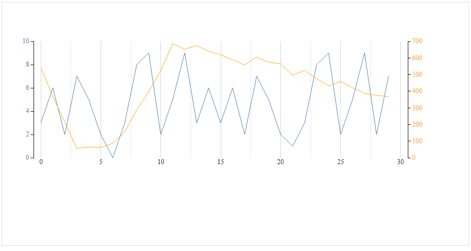

# Proposal graph choice.

## Introduction
In this document, we will choose and elaborate on the graph that is in our opinion the most viable option for the situation described. A list of requirements has been set up to make this choice more transparent. We will describe the pros and cons for this graph and conclude by also explaining why our second choice did not meet all our requirements. To conclude, we will elaborate why our choice fits the requirements and if the pros outweigh the cons and show an example of what our line graph would look like.

## Situation
Our application has to be able to generate a graph of any weather station containing (at this point in time) the following data:
- Humidity
- Temperature (in Celsius)  
  
## Requirements
- The time to generate a graph may not be over one minute.
- The graph has to give an easy overview of the fluctuations since the most recent midnight (00:00).
- The graph should be easily scalable to add more statistics.
- Have to have the option to pick and scale graph to different durations.

## Pros and Cons
__Pros:__
- Shows trends and fluctuations in measurements clearly.
- Shows measurements quite specifically.
- Allow for viewers to make predictions about future data (if the trend is obvious)
- Allows for a wide variety of styling options.

__Cons:__
- Can only be used to show data over time
- Graph might need a lot of visual adjustments to make measurements over a large period of time appear clear.

## Conclusion
A line graph is in our opinion the best type of graph to display temperature and humidity measurements in. Generating a line graph is fast in a lot of different technologies. Line graphs are quite scalable by adding an extra line.

The cons outweigh the cons of a line graph in our situation. The fact that a line graph can only be used to show data over time is not a problem because these measurements will always be viewed in an 'over time' manner. This leaves only one con to outweigh the four pros.

## Example
This is what a generated line graph could look like:

